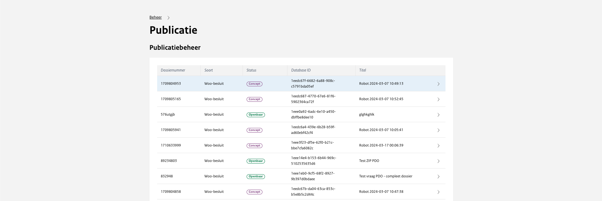
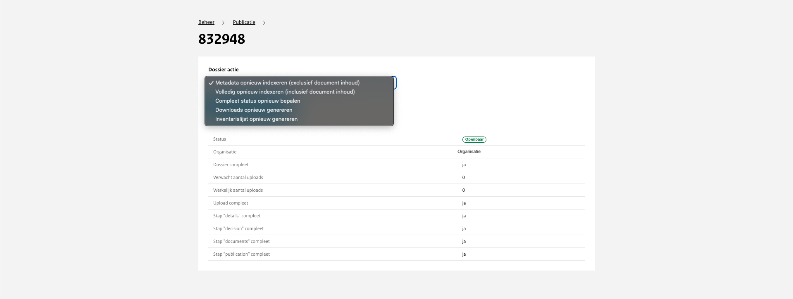

# Publicatiebeheer

```{toctree}
:hidden:

besluitdata
```

Bij publicatiebeheer is het mogelijk om alle publicatie van alle organisaties in te zien. Daarnaast is het mogelijk om per
publicatie de individuele data te zien.



*Dossier action*
Wanneer je op een dossier druk krijg het volgende menu te zien waar de status van het dossier terugte vinden is. Daarnaast
zijn er enkele dossier acties die uitgevoerd kunnen worden.

Dossier actie bestaat uit vijf verschillende acties die uitgevoerd kunnen worden. Per besluit is het mogelijk om de volgende acties te doen:



| Dossier actie                                          | Toelichting                                                                                                                                                                                                                                             |
| ------------------------------------------------------ | ------------------------------------------------------------------------------------------------------------------------------------------------------------------------------------------------------------------------------------------------------- |
| Metadata opnieuw indexeren (exclusief document inhoud) | Met behulp van deze knop kan de website worden aangepast wanneer er wijzigingen worden aangebracht in de Excel. Als er nieuwe URL's of namen worden toegevoegd aan de Excel, kan met deze knop de informatie worden bijgewerkt op de website.           |
| Volledig opnieuw indexeren (inclusief document inhoud) | Wanneer documenten in een dossier worden gewijzigd, wordt de index van het dossier automatisch opnieuw bijgewerkt. Als er iets fout gaat is het met deze actie mogelijk om de validatie van de volledigheid van een dossier nog een keer uit te voeren. |
| Compleet status opnieuw bepalen                        | In uitzonderingssituaties wordt de 'compleet' status opnieuw bepaald.                                                                                                                                                                                   |
| Downloads opnieuw genereren                            | Omdat de dossierdata losstaat van de documenten, worden deze afzonderlijk geïndexeerd. Het re-indexeren van een dossier is alleen in uitzonderlijke situaties nodig.                                                                                    |
| Inventarislijst opnieuw genereren                      | De inventarislijst voor het gekozen dossier wordt opnieuw samengesteld op basis van de huidige status van het dossier.                                                                                                                                  |
