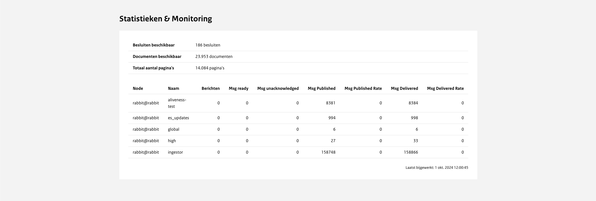

# Statistieken en monitoring

| Naam           | Toelichting                                                                                                                             |
| -------------- | --------------------------------------------------------------------------------------------------------------------------------------- |
| Aliveness-test | De aliveness test is een ping met een bevestiging van het publicatieplatform, die controleert of er nog een verbinding is met RabbitMQ. |
| es_updates     | Elastic search updates.                                                                                                                 |
| global         | Omdat je bij het uploaden van documenten niet alle documenten compatibel zijn wil je snel die feedback te krijgen of er iets fout gaat. |
| high           | De voorrang van functies, bijvoorbeeld bij het kijken of er documenten missen bij het uploaden.                                         |
| ingestor       | Het daadwerkelijk verwerken van documenten, indexeren in elasticsearch etc.                                                             |
