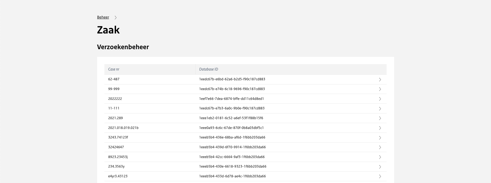

# Verzoekenbeheer

Bij het verzoeken beheer is het mogelijk om alle verzoeken die gepubliceerd zijn op het platform in te zien.

Per verzoek is het mogelijk om twee acties uit te voeren. Deze zijn vergelijkbaar met de acties die bij besluiten ook mogelijk zijn.
Omdat een verzoek of ‘inquiry’ speciaal voor de verzoeker is, is deze anders dan een dossier waardoor deze los van elkaar staan en
op verschillende manieren zijn geïndexeerd.

| Actie                | Toelichting                                                                                                                                                                                                                                                           |
| -------------------- | --------------------------------------------------------------------------------------------------------------------------------------------------------------------------------------------------------------------------------------------------------------------- |
| Regenerate inventory | Wanneer er aanpassingen worden gedaan aan de data van het verzoek dan wordt deze met behulp van deze knop ook geüpdatet naar de voorkant (inventarislijst).  Dit gebeurd in principe automatisch maar in uitzonderlijke gevallen kan dit hier handmatig worden gedaan |
| Regenerate archives  | Wanneer documenten worden veranderd in een wob-verzoek, kunnen veranderingen met behulp van deze functionaliteit doorgevoerd worden.  Dit gebeurd in principe automatisch maar in uitzonderlijke gevallen kan dit hier handmatig worden gedaan                        |
