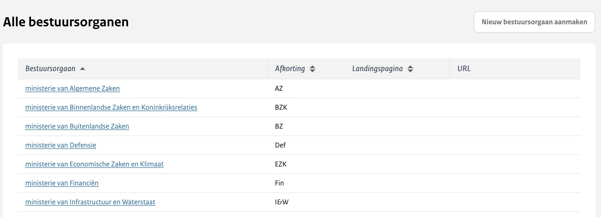

# Bestuursorganen

```{toctree}
:maxdepth: 2
:caption: Inhoudsopgave
```
  
:::{admonition} Note
:class: notification
Deze pagina is alleen beschikbaar voor Super Beheerders.
:::

Tijdens het publiceren kan meegegeven worden welk bestuursorgaan verantwoordelijk is voor de betreffende publicatie.
Dit zal dan zichtbaar zijn op de publicatie zelf, en er kan op gefilterd worden tijdens het zoeken.
Een bestuursorgaan moet, na het aanmaken, gekoppeld worden aan een organisatie voordat deze beschikbaar is tijdens het publiceren. Dit kan via de Organisatiebeheer pagina.

Via de Bestuursorganen pagina is het mogelijk om de lijst van beschikbare bestuursorganen te beheren.



## Nieuw bestuursorgaan aanmaken of wijzigen

Via de knop 'Nieuw bestuursorgaan aanmaken' kan je een nieuw bestuursorgaan toevoegen. Het wijzigen van een bestuursorgaan gaat door op een bestaand bestuursorgaan te klikken, je krijgt dan hetzelfde formulier te zien.


Hierbij geef je de volgende gegevens op:

### Naam

De volledige naam van het bestuursorgaan.

### Afkorting

Optioneel kan je een afkorting meegeven. Deze wordt getoond bij de zoekfilters en in het overzicht van alle bestuursorganen, gecombineerd met de volledige naam.

### URL landingspagina

Deze naam wordt gebruikt om de volledige URL van de landingspagina te maken. Als je hier bijv `abc` invult, zal de URL worden `open.minvws.nl/abc`.
Let er op dat de URL pas werkt als het vinkje 'Zichtbaar op de website' is aangevinkt.

### Zichtbaar op de website

Door 'Zichtbaar op de website' aan te vinken zal de landingspagina aangezet worden en is dit bestuursorgaan ook te zien op de pagina 'Bekijk per bestuursorgaan'.

### Wijzig landingspagina

De knop 'Wijzig landingspagina' is alleen zichtbaar bij bestaande bestuursorganen, dus voor een nieuw bestuursorgaan zal je deze eerst moeten opslaan en vervolgens weer openen.
Deze knop brengt je naar een scherm waar je de landingspagina titel en omschrijving kunt wijzigen.
De landingspagina is zichtbaar als je via de 'Bekijk per bestuursorgaan' pagina naar het betreffende bestuursorgaan navigeert.


#### Titel

De titel die wordt getoond op de landingspagina. Je kunt hier alleen maar tekst gebruiken, geen andere opmaak zoals links of vetgedrukt.

Ons advies is om in de titel van de landingspagina minimaal de naam van de organisatie op te nemen.

#### Omschrijving

Optioneel kan een omschrijving worden toegevoegd.
Deze kan uit meerdere regels bestaan en er kan gebruik gemaakt worden van een gelimiteerde set aan opmaakmogelijkheden, zoals aangegeven op de pagina.
Onderaan het tekstveld is het mogelijk om een voorbeeld te zien van hoe de tekst er op de website uit zal gaan zien.

#### Logo

Optioneel kan er ook een logo getoond worden op de landingspagina. Deze kan toegevoegd worden door op het tabblad Logo te klikken.
Hier kan dan een .svg bestand geupload worden, de maximale toegestane bestandsgrootte is 10mb.
