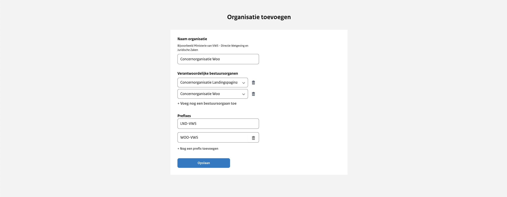

# Configuratie van de organisatie

Iedere concernorganisatie krijgt een eigen organisatie in het uploadportaal van het publicatieplatform. Deze organisatie
kunnen we configureren aan de hand van een aantal parameters. Zie onderstaande fictieve organisatie ‘Concernorganisatie Woo’.

Om de organisatie naar wens te kunnen configureren vragen we je om informatie aan te leveren. Om welke informatie het gaat
lees je in onderstaande paragrafen. We willen je vragen om de tabel uit bijlage 2 in te vullen en per e-mail met ons te delen
via <woo-platform@irealisatie.nl>.

## Naam organisatie

Als naam van de organisatie in het uploadportaal kan de volledige naam of een afkorting van de concernorganisatie worden gebruikt.
Deze naam wordt niet getoond op de publieke website maar is wel zichtbaar in de balie.

## Verantwoordelijke bestuursorganen

Aan iedere organisatie in het uploadportaal kunnen we één of meerdere bestuursorganen koppelen namens wie gepubliceerd kan worden.
Dit is in ieder geval het eigen bestuursorgaan en kan daarnaast een ander bestuursorgaan zijn.
Bij het aanmaken van een nieuwe publicatie wordt gevraagd wie het verantwoordelijke bestuursorgaan is van de publicatie.
Er kan gekozen worden uit de bestuursorganen die zijn gekoppeld aan de organisatie.
Het gekoppelde verantwoordelijke bestuursorgaan wordt getoond op de publieke website op de detailpagina's van de publicaties
en documenten. Daarnaast is het een filteroptie op de algemene zoekpagina.

## Prefixes

Een prefix is een kenmerk dat bestaat uit minimaal 5 karakters. Dit kenmerk zorgt er
samen met het referentienummer voor dat een publicatie uniek is binnen een organisatie. Op deze manier heeft iedere publicatie
een uniek ID in de database. Bij het aanmaken van een nieuwe publicatie wordt gevraagd naar het referentienummer en de prefix.
Het referentienummer is een vrij in te vullen veld en de prefix kan gekozen worden uit een dropdownmenu. Er kan gekozen worden
uit de prefix(es) die zijn gekoppeld aan de organisatie.

De prefix wordt niet getoond op de website, deze wordt enkel gebruikt in de URL van de detailpagina’s van de publicaties
en documenten. Een URL is als volgt opgebouwd: /[informatiecategorie]/[prefix]/[referentienummer], een voorbeeld is:
/convenant/WOO-VWS/123456.
Het is aan de organisatie zelf hoe dit in te richten. Mogelijk is dit afhankelijk van de (werk)processen. Hieronder hebben we
twee opties uitgewerkt met voor- en nadelen om je op weg te helpen.

1. Maak één prefix aan binnen de organisatie
    - Bijvoorbeeld: 'WOO-VWS'
    - *Voordeel*: bij het aanmaken van een publicatie wordt standaard de prefix geselecteerd, omdat er maar één bestaat.
    - *Nadeel*: het (werk)proces moet zo ingericht zijn dat iedere publicatie een uniek referentienummer krijgt
2. Maak een prefix aan voor iedere informatiecategorie binnen de organisatie.
    - Bijvoorbeeld: 'WOO-BESCHIKKING’ of ‘WOO-BES’, ‘WOO-CONVENANT’ of ‘WOO-CON’, ‘WOO-KLACHTOORDEEL’ of ‘WOO-KO’
    - *Voordeel*: het is gemakkelijker om ervoor te zorgen dat de referentienummers uniek zijn binnen een informatiecategorie
    - *Nadeel*: bij het aanmaken van een publicatie moet altijd gekozen worden voor de juiste prefix
