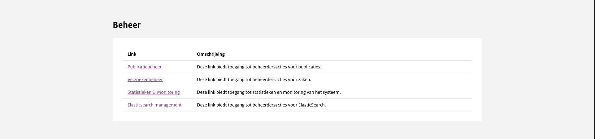

# Algemeen

Dit document is bedoeld voor administrators/beheerders die in staat moeten zijn om het publicatieplatform te kunnen beheren.
Voor onderwerpen omtrent toegangsbeheer en onderwerpen-beheer zie de organisatiebeheer handleiding.

In de onderstaande tabel staat de hiërarchie het platform weergegeven. Dit document is bedoeld voor gebruikers met de toegangsrollen
Beheerder en Superbeheerder.

| Rol                | Bevoegdheden                                                                                                                                                                                                                                                                                                                        |
| ------------------ | ----------------------------------------------------------------------------------------------------------------------------------------------------------------------------------------------------------------------------------------------------------------------------------------------------------------------------------- |
| Superbeheerder     | Een super beheerder heeft toegang tot alle functionaliteiten en heeft toegang tot alle organisaties                                                                                                                                                                                                                                 |
| Beheerder          | Een beheerder heeft toegang tot alle functionaliteit binnen de organisatie.                                                                                                                                                                                                                                                         |
| Organisatie-beheer | Met organisatiebeheer is het mogelijk om gebruikers te beheren door ze aan te maken, te bewerken en te verwijderen. Het is ook mogelijk om zaken en verzoeken aan te maken, echter heeft het geen mogelijkheid om ze te verwijderen. Verder heeft organisatie beher geen toegang tot het lezen van besluiten of andere publicaties. |
| Publicatie-beheer  | Een gebruiker met deze rechten kan zowel publicaties inzien als updaten. Daarbij kan deze wel niet-gepubliceerde publicaties verwijderen                                                                                                                                                                                            |
| Alleen lezen       | Een gebruiker met deze rechten is alleen bevoegd om dossiers en zaken in te zien. De gebruiker is niet bevoegd om deze op enige manier aan te passen.                                                                                                                                                                               |

Naast het organisatiebeheer van de balie is er ook een admin-ingang die meer inzicht geeft in de data op het publicatieplatform,
deze is onderverdeeld in 4 categorieën: Besluit-beheer, Verzoeken-beheer, Statistics & Monitoring en Elasticsearch management.

In dit hoofdstuk worden alle functionaliteiten en betekenis van de data uitgelegd.
