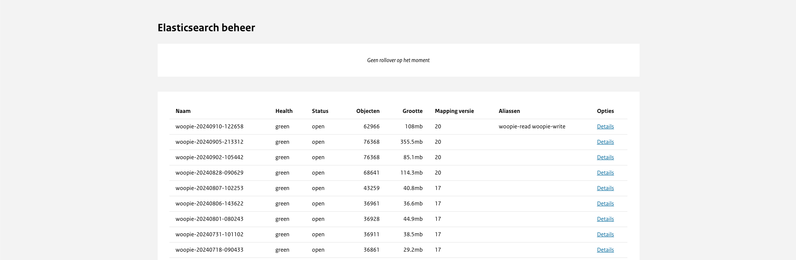

# Elasticsearch management

Het concept achter ons systeem omvat twee indexen: één die continu live staat en gebruikt kan worden en een andere waar gegevens
naar geschreven kunnen worden. Dit ontwerp is bedoeld om te voorkomen dat informatie onvindbaar wordt tijdens de bevordering naar de 'live'-status.

Onder normale omstandigheden gaat het lezen en schrijven naar dezelfde index, maar tijdens de rollover worden het lezen en schrijven gescheiden.

Het gebruik van een 'rollover' is alleen zinvol wanneer er sprake is van specifieke updates aan de software van het publicatie platform,
als dit nodig is dan wordt dit angegeven bij de release. Daarnaast kan het nodig zijn bij issues, aanpassingen of updates aan de Elastic Search.
Een nieuwe 'rollover' houdt in dat de volledige Elasticsearch-zoekdatabase opnieuw wordt gevuld met documenten en gegevens.
