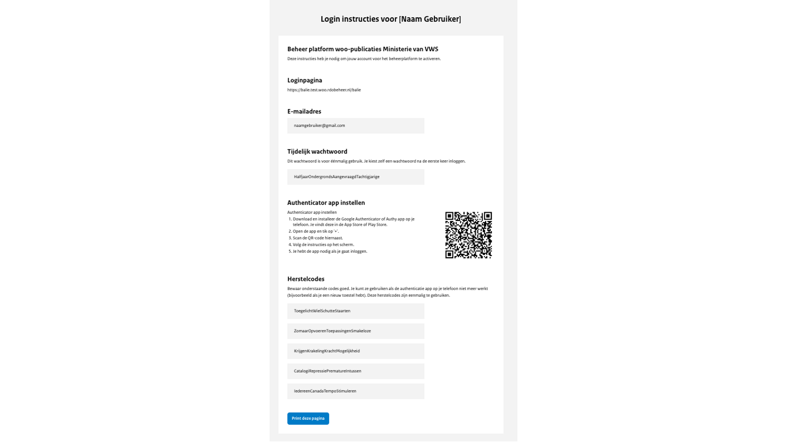

# Inloggen

Om in te kunnen loggen in het uploadportaal van het publicatieplatform heb je een account nodig. De organisatie-beheerder
van jouw organisatie kan dit account voor je aanmaken. Aan een account zijn één of meerdere gebruikersrollen gekoppeld,
die bepalen welke informatie je mag inzien en welke acties je mag uitvoeren.

Wanneer de organisatie-beheerder een account heeft aangemaakt, ontvang je een PDF-bestand met ‘Login instructies’.
Hierin vind je onder andere een tijdelijke wachtwoord, een QR-code waarmee je een authenticator app kan instellen en herstelcodes.
Bewaar de herstelcodes goed, deze kan je gebruiken als de authenticator app niet meer werkt doordat je bijvoorbeeld een nieuw toestel hebt.

## Instellen authenticator app

In het PDF-bestand met ‘Login instructies’ vind je een QR-code waarmee je een authenticator app kunt instellen. Kies welke
authenticator app je wilt gebruiken, bijvoorbeeld Google Authenticator, scan de QR-code op de aangegeven plaats in de app
en volg de instructies op het scherm.

Er wordt steeds een unieke code gegenereerd die je kunt gebruiken om in te loggen, dit noemen wel ook wel tweestapsverificatie.
Tweestapsverificatie is een beveiligingsproces waarbij een gebruiker, naast het invoeren van een wachtwoord, ook een tweede vorm
van verificatie moet doorlopen. Dit gebeurt vaak via een unieke code die naar een geregistreerd apparaat wordt gestuurd, om toegang
te krijgen tot een account.

## Eerste keer inloggen

Om in te loggen in het uploadportaal volg je onderstaande stappen:

- Ga naar <https://balie.woo.irealisatie.nl>
- Het inlogscherm opent, je vult hier jouw e-mailadres in en het tijdelijke wachtwoord dat in het PDF-bestand staat en kiest voor ‘Inloggen’.
- Open de authenticator app, voer de gegenereerde code in en kies voor ‘Controleren’.

- Eenmalig opent een scherm om het wachtwoord bij te werken. Je voert het tijdelijke wachtwoord in, tweemaal een nieuw
wachtwoord en je kiest voor ‘Wachtwoord aanpassen’
- Je ben nu ingelogd in het uploadportaal.

## Inlogproblemen

### Wachtwoord resetten

In het geval een gebruiker het wachtwoord is vergeten is het mogelijk een nieuw tijdelijk wachtwoord te genereren.
Dit wachtwoord kan dan gebruikt worden als tijdelijk wachtwoord en moet worden aangepast wanneer de gebruiker daarna weer
voor de eerste keer inlogt.

### 2-Factor Authenticatie

In het geval een gebruiker een nieuwe telefoon heeft of een nieuwe authenticatie app gebruikt is het mogelijk om de de 2FA
te resetten. De gebruiker krijgt dan weer opnieuw een QR-code die gescand moet worden in de authenticatie app
