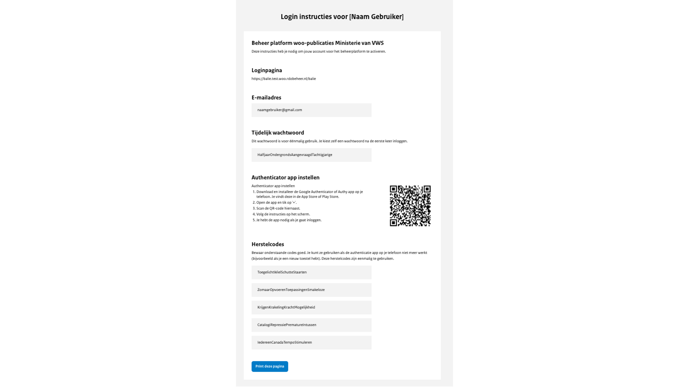

# Eerste keer inloggen

Om in te loggen in het uploadportaal volg je onderstaande stappen:

- Ga naar <https://balie.woo.irealisatie.nl>
- Het inlogscherm opent, je vult hier jouw e-mailadres in en het tijdelijke wachtwoord dat in het PDF-bestand staat en kiest voor ‘Inloggen’.
- Open de authenticator app, voer de gegenereerde code in en kies voor ‘Controleren’.

- Eenmalig opent een scherm om het wachtwoord bij te werken. Je voert het tijdelijke wachtwoord in, tweemaal een nieuw
wachtwoord en je kiest voor ‘Wachtwoord aanpassen’
- Je ben nu ingelogd in het uploadportaal.
