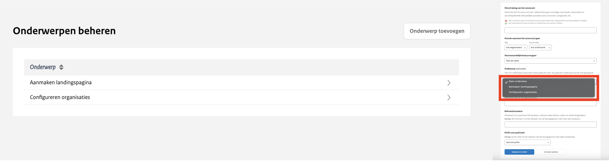

# Onderwerpen beheer

Je kunt een onderwerp aan een publicatie koppelen om de openbaar gemaakte informatie binnen de organisatie op een logische manier
te structureren, naast de bestaande informatiecategorieën. Dit biedt je de flexibiliteit om de informatie beter te organiseren.
De onderwerpen kunnen door de organisatie zelf beheerd en aangepast worden.

Om het menu te openen, klik je bovenaan in de zwarte balk op 'Onderwerpen'. Je ziet dan een overzicht van alle onderwerpen die
binnen de organisatie zijn aangemaakt. Vanuit dit overzicht kun je eenvoudig nieuwe onderwerpen toevoegen en bestaande onderwerpen
bewerken, zodat de structuur van de informatie altijd up-to-date blijft en aansluit bij de behoeften van de organisatie.

## Nieuw onderwerp toevoegen

Via de knop 'Onderwerp toevoegen' kan je een nieuw onderwerp toevoegen.

Het is belangrijk dat een organisatie goed nadenkt over welke onderwerpen ze willen aanmaken en gebruiken. De onderwerpen
zullen namelijk verschijnen in de filteropties op de website en kunnen, indien van toepassing, ook zichtbaar zijn op de landingspagina.
Daarnaast is het belangrijk om te realisaeren dat een onderwerp wel gewijzigd kan worden maar niet verwijderd.

## Bestaand onderwerp wijzigen

Klik op een onderwerp om de tekst ervan aan te passen. Zodra je een wijziging aanbrengt, wordt deze direct doorgevoerd naar
alle publicaties die aan dat onderwerp zijn gekoppeld.

:::{admonition} Let op!
:class: attention
Het is niet mogelijk om onderwerpen te verwijderen.
:::

## Onderwerp koppelen aan een publicatie

Bij het aanmaken van een nieuwe publicatie is het in stap 1 - Basisgegevens mogelijk om een onderwerp te koppelen aan de publicatie.
Je kan kiezen uit de aangemaakte onderwerpen in het menu Onderwerpen. Er kan maximaal één onderwerp gekoppeld worden aan een publicatie.
Het is optioneel om dit te doen en kan achteraf gewijzigd worden. Om dit te kunnen doen heb je de rechten/de rol 'publicatie-beheer' nodig.
