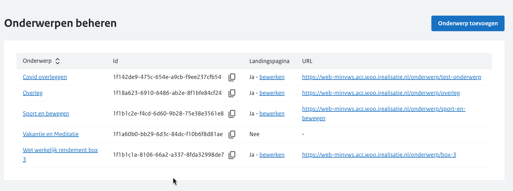
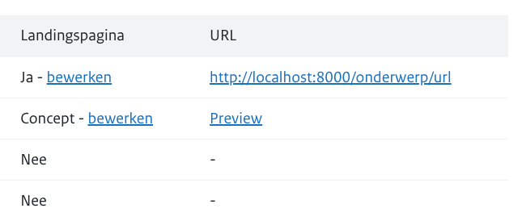
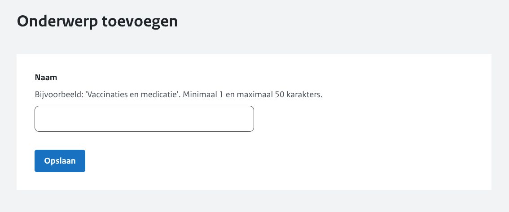
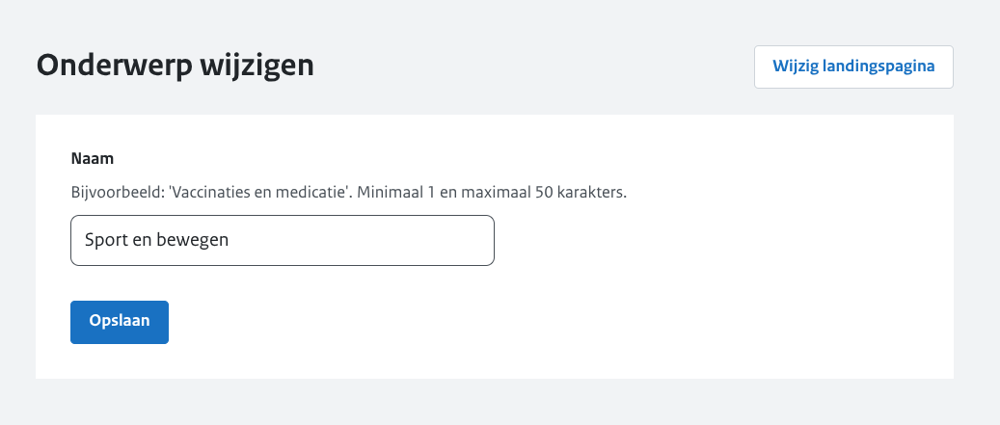
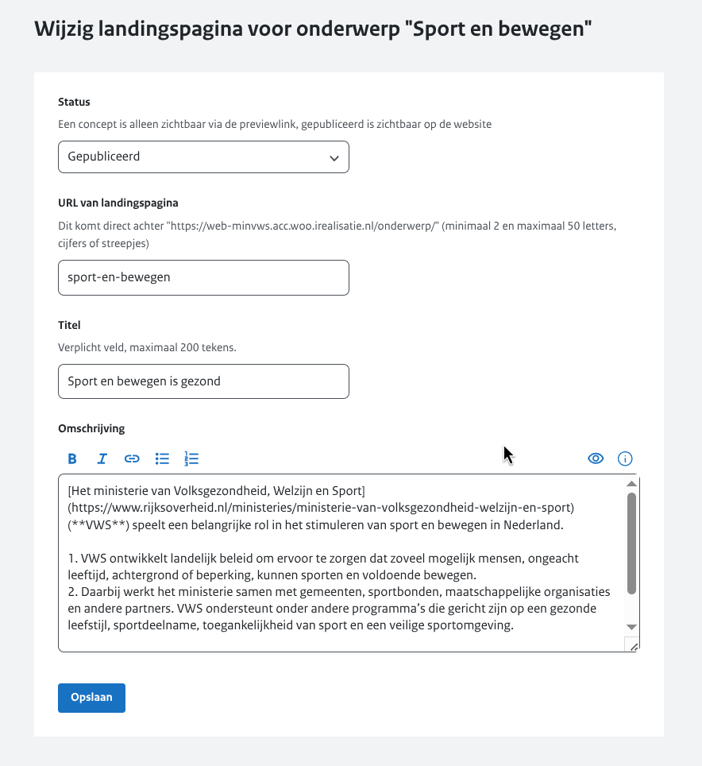
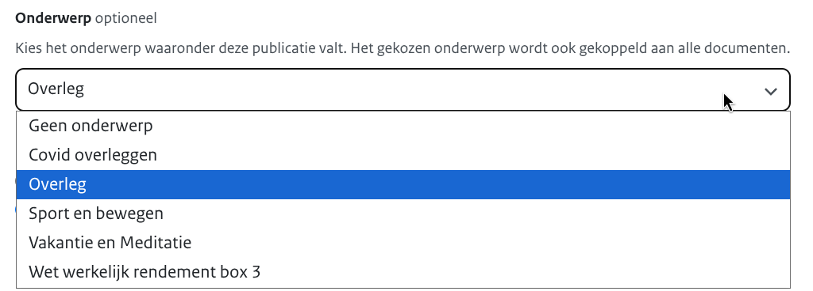

# Onderwerpen beheer

Je kunt een onderwerp aan een publicatie koppelen om de openbaar gemaakte informatie binnen de organisatie op een logische manier
te structureren, naast de bestaande informatiecategorieën. Dit biedt je de flexibiliteit om de informatie beter te organiseren.
De onderwerpen kunnen door de organisatie zelf beheerd en aangepast worden.

Om het menu te openen, klik je bovenaan in de zwarte balk op 'Onderwerpen'. Je ziet dan een overzicht van alle onderwerpen die
binnen de organisatie zijn aangemaakt. Vanuit dit overzicht kun je eenvoudig nieuwe onderwerpen toevoegen en bestaande onderwerpen
bewerken, zodat de structuur van de informatie altijd up-to-date blijft en aansluit bij de behoeften van de organisatie.

## Onderwerpen overzicht

Op de onderwerpen overzichtpagina zijn de volgende kolommen zichtbaar:

| Kolom | Omschrijving |
| --- | --- |
| **Onderwerp** | De naam van het onderwerp. |
| **ID** | De unieke sleutel waarmee het onderwerp via een API-call kan worden opgevraagd of bijgewerkt. |
| **Kopieer-icoon** | Hiermee kan het ID eenvoudig naar het klembord worden gekopieerd. |
| **Landingspagina** | Geeft aan of er voor het onderwerp een landingspagina bestaat en of deze gepubliceerd is of nog in concept staat. Is er een landingspagina, dan verschijnt een link waarmee u deze direct kunt bewerken. |
| **URL** | Het webadres van de landingspagina van het onderwerp. Staat de pagina nog in concept, dan is dit het adres van de previewpagina. De verschillende statusses zijn te zien in onderstaande afbeelding: |

## Nieuw onderwerp toevoegen

Via de knop 'Onderwerp toevoegen' kan je een nieuw onderwerp toevoegen.

Het is belangrijk dat een organisatie goed nadenkt over welke onderwerpen ze willen aanmaken en gebruiken. De onderwerpen
zullen namelijk verschijnen in de filteropties op de website en kunnen, indien van toepassing, ook zichtbaar zijn op de landingspagina.
Daarnaast is het belangrijk om te realisaeren dat een onderwerp wel gewijzigd kan worden maar niet verwijderd.

## Bestaand onderwerp wijzigen

Klik op een onderwerp om de tekst ervan aan te passen. Zodra je een wijziging aanbrengt, wordt deze direct doorgevoerd naar
alle publicaties die aan dat onderwerp zijn gekoppeld.

:::{admonition} Let op!
:class: warning
Het is niet mogelijk om onderwerpen te verwijderen.
:::

## Onderwerp landingspagina's

Onderwerpen kunnen een eigen landingspagina hebben. Op deze landingspagina kan aanvullende content worden toegevoegd, zoals een titel en omschrijving.

Om de landingspagina van een onderwerp te activeren of te wijzigen, klik je bij het betreffende onderwerp op **Wijzig landingspagina**.

Vervolgens kunnen de volgende velden worden ingevuld:

| Veld | Omschrijving |
| --- | --- |
| **Status** | Bepaalt of de landingspagina als concept of gepubliceerd wordt opgeslagen. Een **concept** is alleen zichtbaar via de previewlink. Een **gepubliceerde** landingspagina is zichtbaar op de website. |
| **URL van landingspagina** | Het laatste gedeelte van de URL van de landingspagina. Dit gedeelte wordt achter `/onderwerp/` geplaatst. De URL moet uit minimaal 2 en maximaal 50 letters, cijfers of streepjes bestaan. |
| **Titel** | De titel van de landingspagina. Dit is een verplicht veld en mag maximaal 200 tekens bevatten. |
| **Omschrijving** | Hier kan de inhoudelijke omschrijving van het onderwerp worden toegevoegd. De tekst kan worden opgemaakt, bijvoorbeeld met **vetgedrukte tekst**, *cursieve tekst*, opsommingen en genummerde lijsten. Ook kunnen links worden toegevoegd. |

Sla de wijzigingen op nadat alle gewenste gegevens zijn ingevuld.

### Opmaak van de content

Meer uitleg over het opmaken van content vind je **[hier](/organisatiebeheer/text-editor.md)**.

## Een verhaallijn activeren en beheren

Elke onderwerp pagina kan één verhaallijn bevatten. Kijk [hier](/organisatiebeheer/verhaallijnenbeheer.md) om te lezen hoe een verhaallijn kan worden toegevoegd en beheerd op een onderwerp pagina.

## Onderwerp koppelen aan een publicatie

Bij het [aanmaken van een nieuwe publicatie](/publiceren/index.md) is het in stap 1 - Basisgegevens mogelijk om een onderwerp te koppelen aan de publicatie.
Je kan kiezen uit de aangemaakte onderwerpen in het menu Onderwerpen. Er kan maximaal één onderwerp gekoppeld worden aan een publicatie.
Het is optioneel om dit te doen en kan achteraf gewijzigd worden. Om dit te kunnen doen heb je de rechten/de rol 'publicatie-beheer' nodig.

