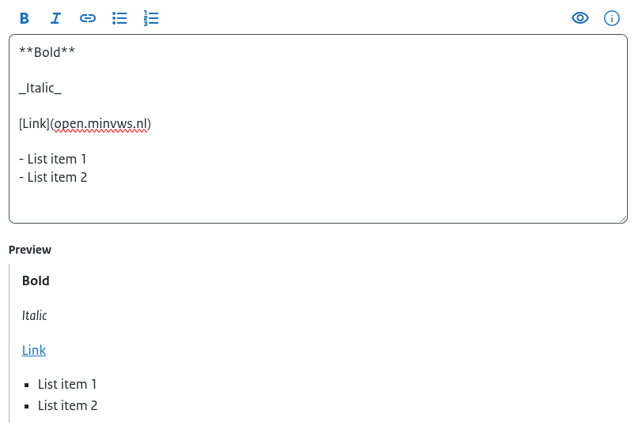

# Text editor uitgelegd

In de teksteditor kan tekst op twee manieren worden opgemaakt:

- met de knoppen boven het invoerveld;
- door de Markdown-opmaak rechtstreeks in de tekst in te voeren.

Zo kun je bijvoorbeeld tekst vet maken door op de knop **Vet** te klikken, maar je kunt ook zelf `**tekst**` invoeren. Hetzelfde geldt voor cursieve tekst, links en lijsten.

De volgende opmaakopties zijn beschikbaar:

| Optie | Omschrijving |
| --- | --- |
| **Vet** | Maak geselecteerde tekst vet. De tekst wordt tussen `**` geplaatst, bijvoorbeeld `**Vet**`. |
| *Cursief* | Maak geselecteerde tekst cursief. De tekst wordt tussen `_` geplaatst, bijvoorbeeld `_Cursief_`. |
| **Link** | Voeg een link toe aan geselecteerde tekst. Een link wordt opgebouwd als `[tekst](url)`, bijvoorbeeld `[Link](https://open.minvws.nl)`. |
| **Opsomming** | Maak een lijst met opsommingstekens. Iedere regel begint met `-`. |
| **Genummerde lijst** | Maak een genummerde lijst. Iedere regel begint met een nummer, bijvoorbeeld `1.`. |
| **Preview** | Met het oog-icoon kan een voorbeeldweergave worden getoond. De preview verschijnt onder het invoerveld en laat zien hoe de opgemaakte tekst op de website wordt weergegeven. |
| **Info** | Met het informatie-icoon wordt een overzicht getoond van alle beschikbare opmaakmogelijkheden en de bijbehorende Markdown-syntax. |
