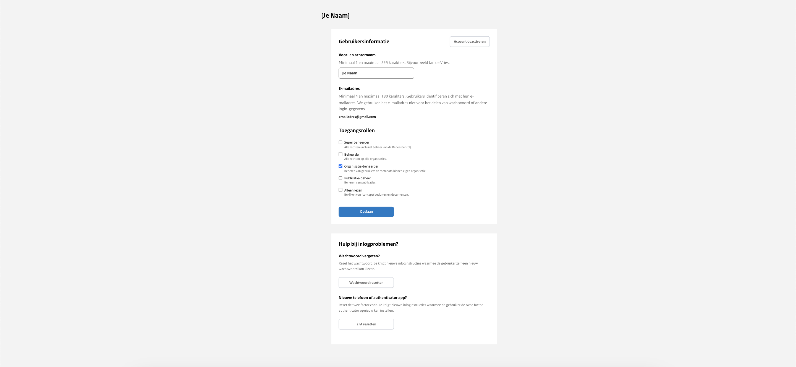

<!-- markdownlint-disable MD024 -->

# Toegangsbeheer

Je opent het Toegangsbeheer-menu door in de zwarte balk bovenaan op 'Toegangsbeheer' te klikken. Dit opent een overzicht van
alle gebruikers die momenteel toegang hebben tot de organisatie of die gedeactiveerd zijn. Actieve gebruikers zijn accounts
die nog kunnen inloggen en het uploadportaal kunnen gebruiken. Gedeactiveerde gebruikers zijn accounts die zijn uitgeschakeld en
geen toegang meer hebben.

In dit overzicht worden niet alleen de namen van de gebruikers weergegeven, maar ook hun specifieke rollen binnen de organisatie
en de datum van hun laatste inlogpoging.

Vanuit dit scherm heb je verscheidene beheermogelijkheden. Je kunt nieuwe gebruikers aanmaken en bestaande gebruikersrollen of
-gegevens aanpassen. Indien nodig is het mogelijk om gebruikersaccounts te deactiveren.

## Nieuwe gebruiker aanmaken

Als organisatiebeheerder ben je onder andere verantwoordelijk voor het aanmelden van nieuwe gebruikers binnen uw organisatie.
Om een nieuwe gebruiker aan te maken moeten de volledige naam, de toegangsrechten en het e-mailadres ingevuld worden.

### Voor- en achternaam

Gebruik de volledige voor- en achternaam van de gebruiker. Dit kan achteraf nog aangepast worden indien nodig.

### Toegangsrollen

De toegangsrollen bepalen welke rechten de desbetreffende gebruiker heeft. Deze rechten kunnen achteraf nog
worden aangepast door de organisatiebeheerder.

Als organisatiebeheerder is het mogelijk om een collega ook de rechten zoals  ‘organisatiebeheerder’ te geven. Met publicatiebeheer
kan iemand publicatie aanmaken en publiceren. De rol ‘alleen lezen’ geeft je collega de mogelijkheid om publicaties en zaken in te
zien zonder dat er wijzigingen kunnen worden aangebracht.

### E-mailadres

Het e-mailadres wordt gebruikt om in te loggen.

:::{admonition} Let op!
:class: warning
Het is niet mogelijk om het e-mailadres achteraf te wijzigen.
:::

De login instructies delen
Wanneer het account succesvol is aangemaakt is het mogelijk om de inlog-instructies te downloaden en naar de desbetreffende
gebruiker te sturen.

:::{admonition} Let op!
:class: warning
Dit is het enige moment dat deze instructies gedownload kunnen worden.
:::

Het e-mailadres en tijdelijke wachtwoord is nodig om in te loggen op de uploadomgeving. Het tijdelijke wachtwoord kan eenmalig
worden gebruikt om in te loggen, waarna de gebruiker een eigen wachtwoord kan instellen.

Om in te kunnen loggen in het uploadportaal is 2FA benodigd. De gebruiker dient de QR-code te scannen in een authenticatie
app om de 2FA te activeren.

Het wordt aanbevolen om het .pdf-bestand goed te bewaren in het geval de gebruiker geen toegang meer heeft tot de authenticatie-app.
In een dergelijk geval kunnen de herstelcodes worden gebruikt om alsnog in te loggen.

## Gebruikersinformatie wijzigen

### Voor- en achternaam

De voor – en achternaam kan altijd aangepast worden.

### E-mailadres

Het is niet mogelijk het e-mailadres achteraf aan te passen. Het is daarom belangrijk dat het juiste e-mailadres wordt
gebruikt tijdens de registratie.

### Toegangsrollen

De toegangsrollen kunnen achteraf nog aangepast of bijgevoegd worden. Indien een gebruiker andere toegangsrechten
nodig heeft is het niet nodig een nieuw account aan te maken.

## Inlogproblemen

### Wachtwoord resetten

In het geval een gebruiker het wachtwoord is vergeten is het mogelijk een nieuw tijdelijk wachtwoord te genereren.
Dit wachtwoord kan dan gebruikt worden als tijdelijk wachtwoord en moet worden aangepast wanneer de gebruiker daarna
weer voor de eerste keer inlogt.

### 2-Factor Authenticatie

In het geval een gebruiker een nieuwe telefoon heeft of een nieuwe authenticatie app gebruikt is het mogelijk om de de
2FA te resetten. De gebruiker krijgt dan weer opnieuw een QR-code die gescand moet worden in de authenticatie app.

## Gebruiker deactiveren

In het geval een medewerker de organisatie verlaat of een andere rol gaat vervullen is het belangrijk dat de organisatiebeheerder
het account van de persoon deactiveert. Op deze manier is het voor de desbetreffende gebruiker niet meer mogelijk om te loggen op
de balieomgeving.

