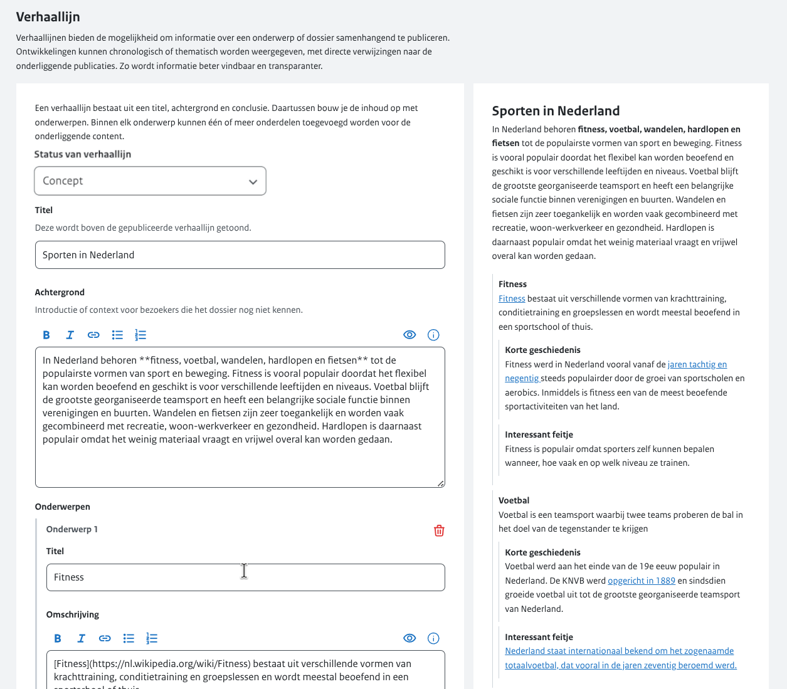
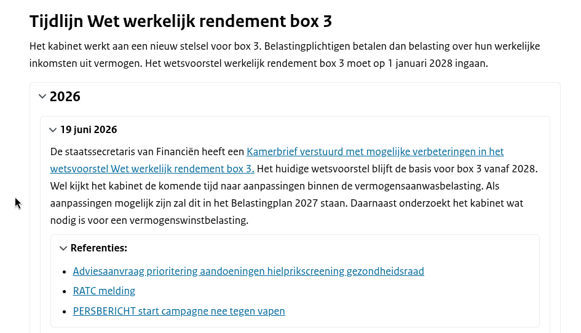

# Verhaallijnen beheer

Met verhaallijnen kan informatie over een onderwerp of dossier in samenhang worden gepubliceerd.
Ontwikkelingen kunnen chronologisch of thematisch worden weergegeven, met directe verwijzingen naar de onderliggende publicaties.
Hierdoor wordt informatie beter vindbaar en krijgt de bezoeker meer inzicht in de samenhang tussen verschillende publicaties.

Elke [onderwerp pagina](/organisatiebeheer/onderwerpenbeheer.md) kan één verhaallijn bevatten.

Een verhaallijn bestaat uit een **titel, achtergrond**, één of meer **onderwerpen** en een **conclusie**. Binnen ieder onderwerp kunnen één of meer onderdelen worden toegevoegd waarin de inhoud van de verhaallijn wordt opgebouwd.

## Verhaallijn activeren

Met de keuzelijst `Status van Verhaallijn` bepaalt u of een verhaallijn op de landingspagina van een onderwerp wordt getoond.

- Kies Gepubliceerd om de verhaallijn op de onderwerppagina weer te geven.
- Kies Concept om de verhaallijn niet op de onderwerppagina te tonen. U kunt de verhaallijn dan nog wel bewerken.

## Verhaallijn aanpassen

Een verhaallijn heeft de volgende onderdelen:

| Label | Omschrijving |
| --- | --- |
| **Titel** | De titel van de verhaallijn. |
| **Achtergrond** | Introductie of context voor bezoekers die het dossier nog niet kennen. |
| **Onderwerpen** | Een item van een verhaallijn. |
| **Conclusie** | Afsluitende samenvatting die onderaan de gepubliceerde verhaallijn staat. |

### Sub onderdelen

Onderwerpen kunnen 5 niveaus van sub onderdelen hebben. In het onderstaande voorbeeld zijn dat:

| Item | Content |
| --- | --- |
| **Titel van het onderwerp** | Tijdlijn Wet werkelijk rendement box 3 |
| **Titel van onderwerp 1** | 2026 |
| **Titel van onderdeel 1.1** | 19 juni 2026 |
| **Titel van onderdeel 1.1.1** | Referenties |

### Opmaak van de content

Meer uitleg over het opmaken van content vind je **[hier](/organisatiebeheer/text-editor.md)**.
