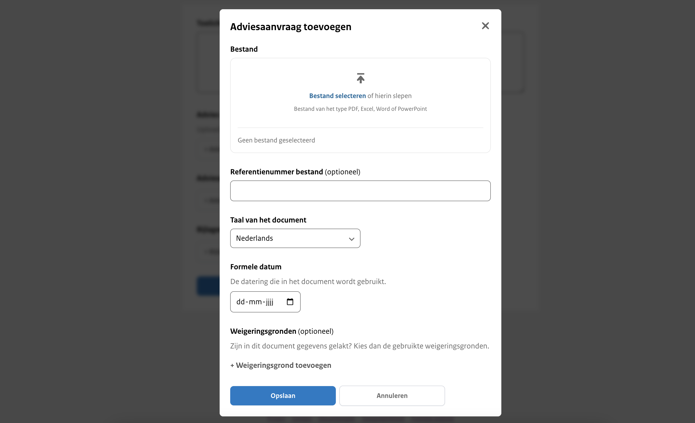

<!-- markdownlint-disable MD024 -->

# Stap 2: Advies gegevens

## Toelichting op het advies

Hier geef je een beknopte beschrijving van de inhoud van het advies. Deze toelichting verschijnt bovenaan op de website
en biedt een overzichtelijke introductie van de belangrijkste punten. Zorg ervoor dat de beschrijving helder en informatief is,
zodat lezers snel begrijpen waar het advies over gaat. Dit veld is verplicht om in te vullen.

## Advies

Upload hier het hoofddocument van het advies. Dit veld is verplicht om verder te gaan.

:::{admonition} Let op!
:class: attention
Je kunt slechts één document uploaden.
:::

### Bestand

Hier upload je maximaal één bestand van het type PDF, Excel, Word of PowerPoint.

### Referentienummer bestand

Dit is een vrij invulveld dat optioneel is om te vullen. Bijvoorbeeld een verwijzing naar de interne vindplaats of verantwoordelijke
van het document. Wordt niet getoond op de website.

### Taal van het document

Keuze uit Nederlands (standaard ingevuld) of Engels.

### Formele datum

De datum die wordt gehanteerd in het advies.

### Weigeringsgronden

Wanneer gegevens in het document gelakt zijn, zijn hiervoor weigeringsgronden gebruikt uit de Wet open overheid. Selecteer
indien van toepassing welke weigeringsgronden gebruikt zijn. Dit is een standaardlijst met weigeringsgronden waar je uit kan kiezen.

## Adviesaanvraag

Een adviesaanvraag bijlage is bij sommige adviezen verplicht om openbaar te maken, bij andere adviezen is dit niet verplicht.  Er is daarom een optioneel veld 'Adviesaanvraag' toegevoegd.

### Bestand

Hier upload je maximaal 1 bestand van het type PDF, Excel, Word of PowerPoint.

### Referentienummer bestand

Dit is een vrij invulveld. Bijvoorbeeld een verwijzing naar de interne vindplaats of verantwoordelijke van de adviesaanvraag.
Wordt niet getoond op de website.

### Taal van het document

Keuze uit Nederlands (standaard ingevuld) of Engels

### Formele datum

De datum die wordt gehanteerd in de adviesaanvraag.

### Weigeringsgronden

De weigeringsgrond(en) die is/zijn gebruikt in het document om gegevens te lakken afkomstig uit de Wet open overheid. Dit is
een standaardlijst met weigeringsgronden waar je uit kan kiezen.

## Bijlage

Wanneer er aanvullende informatie beschikbaar is gerelateerd aan het advies of wanneer er bij het advies aanvullende
informatie beschikbaar is die niet in het 'hoofddocument' of de 'adviesaanvraag' voorkomt, is het mogelijk om een bijlage toe te voegen.

### Bestand

Hier upload je maximaal 1 bestand van het type PDF, Excel, Word of PowerPoint.

### Referentienummer bestand

Dit is een vrij invulveld. Bijvoorbeeld een verwijzing naar de interne vindplaats of verantwoordelijke van het document.
Wordt niet getoond op de website.

### Soort document

Je geeft hier aan wat voor soort document dat de bijlage is. Dit is een standaard lijst met documentsoorten waar je uit kan kiezen.

### Taal van het document

Keuze uit Nederlands (standaard ingevuld) of Engels

### Formele datum

De datum die wordt gehanteerd in de bijlage.

### Weigeringsgronden

De weigeringsgrond(en) die is/zijn gebruikt in het document om gegevens te lakken afkomstig uit de Wet open overheid. Dit is
een standaardlijst met weigeringsgronden waar je uit kan kiezen.

