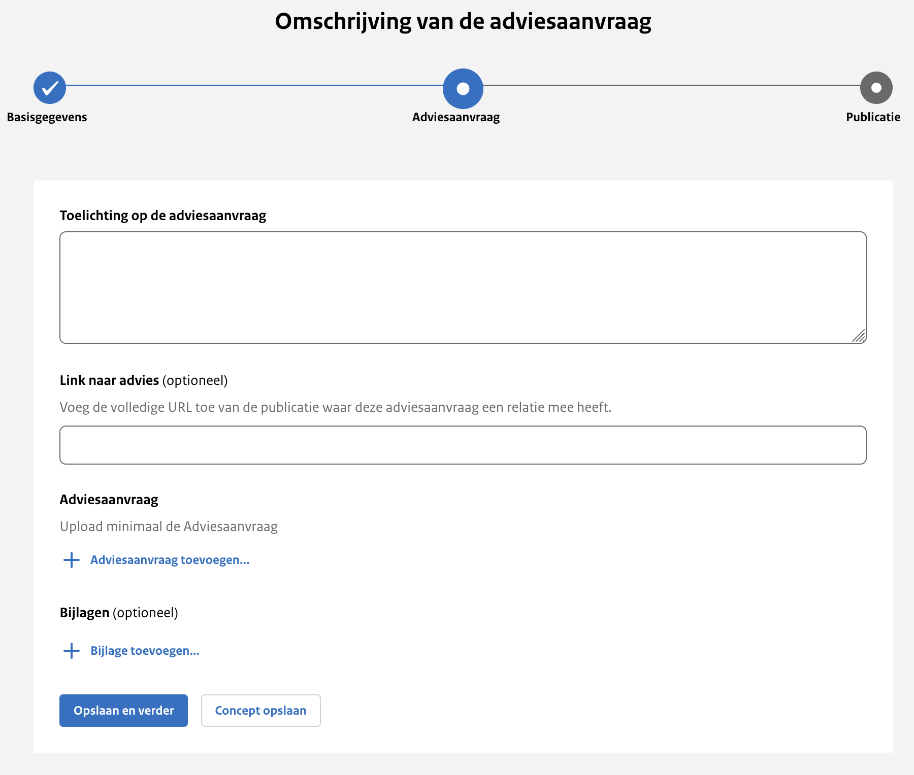

<!-- markdownlint-disable MD024 -->

# Stap 2: Advies gegevens

## Toelichting op de adviesaanvraag

Hier geef je een beknopte beschrijving van de inhoud van de adviesaanvraag. Deze toelichting verschijnt bovenaan op de website
en biedt een overzichtelijke introductie van de belangrijkste punten. Zorg ervoor dat de beschrijving helder en informatief is,
zodat lezers snel begrijpen waar de adviesaanvraag over gaat. Dit veld is verplicht om in te vullen.

## Link naar advies

Vul hier de de volledige URL in van de publicatie waar deze adviesaanvraag een relatie mee heeft. Dit kan dus op dit platform zelf zijn, of ergens anders.

## Adviesaanvraag

Hier upload je de adviesaanvraag zelf, dit opent in een aparte dialoog.

### Bestand

Het bestand zelf, maximaal één bestand van het type PDF, Excel, Word of PowerPoint.

### Referentienummer bestand

Dit is een optioneel vrij invulveld. Bijvoorbeeld een verwijzing naar de interne vindplaats of verantwoordelijke van het document. Wordt niet getoond op de website.

### Taal van het document

Keuze uit Nederlands (standaard ingevuld) of Engels.

### Formele datum

De datum die wordt gehanteerd in de adviesaanvraag.

### Weigeringsgronden

Wanneer gegevens in het document gelakt zijn, zijn hiervoor weigeringsgronden gebruikt uit de Wet open overheid. Selecteer
indien van toepassing welke weigeringsgronden gebruikt zijn. Dit is een standaardlijst met weigeringsgronden waar je uit kan kiezen.

## Bijlagen

Wanneer er aanvullende informatie beschikbaar is gerelateerd aan de adviesaanvraag of wanneer er bij de adviesaanvraag aanvullende
informatie beschikbaar is die niet in het 'hoofddocument' of de 'adviesaanvraag' voorkomt, is het mogelijk om een bijlage toe te voegen.

### Bestand

Hier upload je maximaal 1 bestand van het type PDF, Excel, Word of PowerPoint.

### Referentienummer bestand

Dit is een vrij invulveld. Bijvoorbeeld een verwijzing naar de interne vindplaats of verantwoordelijke van het document.
Wordt niet getoond op de website.

### Soort document

Je geeft hier aan wat voor soort document dat de bijlage is. Dit is een standaard lijst met documentsoorten waar je uit kan kiezen.

### Taal van het document

Keuze uit Nederlands (standaard ingevuld) of Engels

### Formele datum

De datum die wordt gehanteerd in de bijlage.

### Weigeringsgronden

De weigeringsgrond(en) die is/zijn gebruikt in het document om gegevens te lakken afkomstig uit de Wet open overheid. Dit is
een standaardlijst met weigeringsgronden waar je uit kan kiezen.
