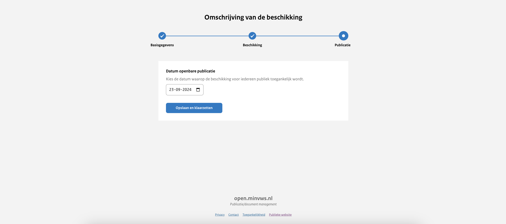

# Uploadstraat stap 3: Beschikking publiceren

Datum van publicatie
: Bij het publiceren van de publicatie heb je de mogelijkheid te bepalen wanneer deze zichtbaar wordt voor het publiek. Je kunt
ervoor kiezen de publicatie onmiddellijk openbaar te maken waardoor deze direct toegankelijk is voor iedereen. Daarnaast heb
je de mogelijkheid om een publicatie van tevoren in te plannen door een datum in de toekomst te kiezen waarop de publicatie
automatisch openbaar wordt gemaakt.

