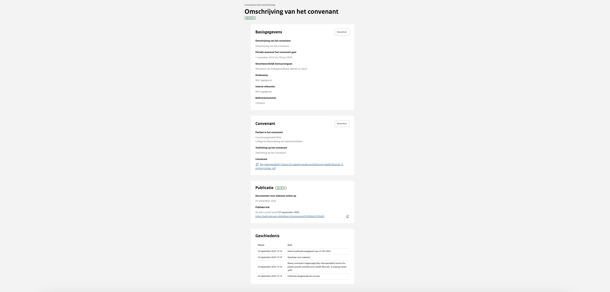

# Wijzigen van publicatie

Om een convenant te wijzigen ga je naar het overzicht ‘Alle publicaties’ en klik je op de desbetreffende publicatie. Via het overzicht van de publicatie kun je de informatie bewerken.

Wijzigen voor de publicatie
: Wanneer de publicatie is opgeslagen en nog niet de status ‘Openbaar’ heeft, is het nog mogelijk om alles aan te passen of om
het hoofddocument te verwijderen. Daarnaast kan je een convenant verwijderen wanneer het nog het label ‘Concept’ heeft door
naar beneden te scrollen en onder het kopje ‘Gevarenzone’ op ‘Convenant verwijderen’ te klikken.

Wijzigen na de publicatie
: Zodra het convenant openbaar is, kun je het niet meer verwijderen, maar wel wijzigingen aanbrengen. De wijzigingen worden
geregistreerd in de geschiedenis van de publicatie. Zo is het mogelijk om het document te vervangen door een nieuwe versie van het document.
Als je na de publicatie aanpassingen doet aan het convenant wordt deze geregistreerd in de geschiedenis van de publicatie.
Deze geschiedenis is openbaar terug te vinden op de pagina van het convenant.
