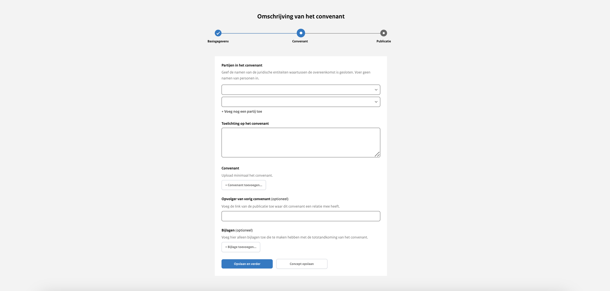
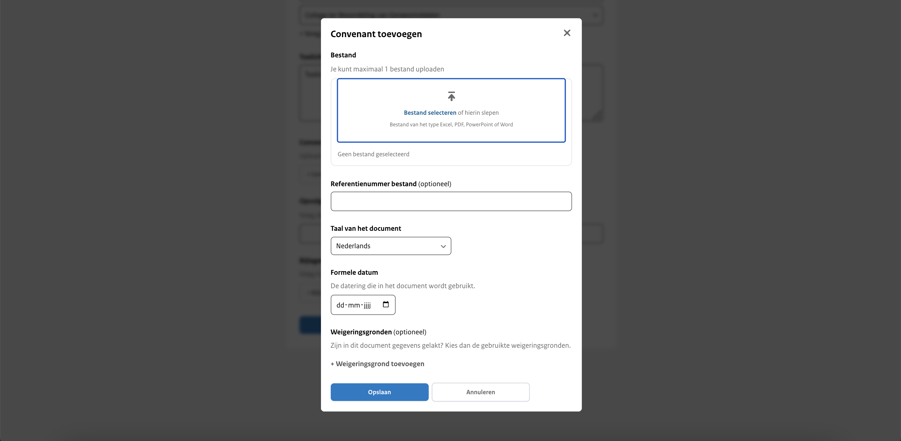
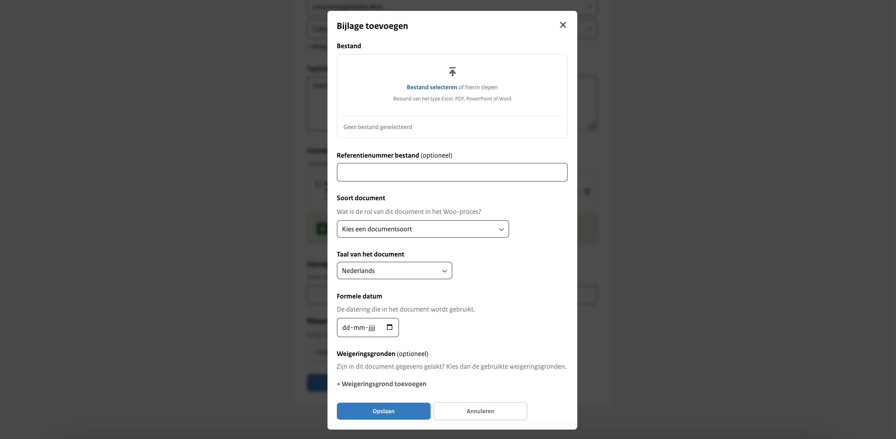

<!-- markdownlint-disable MD024 -->

# Stap 2: Convenant gegevens

## Partijen in het convenant

Vul hier minimaal twee partijen in. Je kunt kiezen uit het dropdown-menu met bestuursorganen of zelf een partij invullen.
Partijen zijn juridische entiteiten waartussen de overeenkomst is gesloten. Voer geen namen van personen in. Dit veld is
verplicht om in te vullen.

## Toelichting op het convenant

Hier geef je een beknopte beschrijving van de inhoud van het convenant. Deze toelichting verschijnt bovenaan op de website en
biedt een overzichtelijke introductie van de belangrijkste punten. Zorg ervoor dat de beschrijving helder en informatief is,
zodat lezers snel begrijpen waar het convenant over gaat. Dit veld is verplicht om in te vullen.

## Het Convenant

Upload hier het hoofddocument van het convenant. Dit veld is verplicht om verder te gaan.

:::{admonition} Let op!
:class: warning
Je kunt slechts één document uploaden.
:::

### Bestand

Hier upload je maximaal één bestand van het type PDF, Excel, Word of PowerPoint.

### Referentienummer bestand

Dit is een invulveld dat optioneel is om te vullen. Bijvoorbeeld een verwijzing naar de interne vindplaats of verantwoordelijke
van het document. Wordt niet getoond op de website.

### Taal van het document

Keuze uit Nederlands (standaard ingevuld) of Engels.

### Formele datum

De datum die wordt gehanteerd in het convenant.

### Weigeringsgronden

Wanneer gegevens in het document zijn weggelakt, zijn hiervoor weigeringsgronden gebruikt uit de Wet open overheid. Selecteer
indien van toepassing welke weigeringsgronden gebruikt zijn. Dit is een standaardlijst met weigeringsgronden waar je uit kunt kiezen.

## Opvolger van vorig convenant

In het geval dit convenant een opvolger is van een voorgaand convenant, voeg je hier de link naar de desbetreffende publicatie toe.

## Bijlage

Wanneer er aanvullende informatie beschikbaar is gerelateerd aan het convenant of wanneer er bij het convenant aanvullende
informatie beschikbaar is die niet in het 'hoofddocument' voorkomt, is het mogelijk om een bijlage toe te voegen.

### Bestand

Hier upload je maximaal één bestand van het type PDF, Excel, Word of PowerPoint.

### Referentienummer bestand

Dit is een vrij invulveld. Bijvoorbeeld een verwijzing naar de interne vindplaats of verantwoordelijke van het document.
Wordt niet getoond op de website.

### Soort document

Je geeft hier aan wat voor soort document dat de bijlage is. Dit is een standaard lijst met documentsoorten waar je uit kunt kiezen.

### Taal van het document

Keuze uit Nederlands (standaard ingevuld) of Engels.

### Formele datum

De datum die wordt gehanteerd in het convenant.

### Weigeringsgronden

De weigeringsgrond(en) die zijn gebruikt in het document om gegevens te lakken afkomstig uit de Wet open overheid. Dit
is een standaardlijst met weigeringsgronden waar je uit kunt kiezen.

