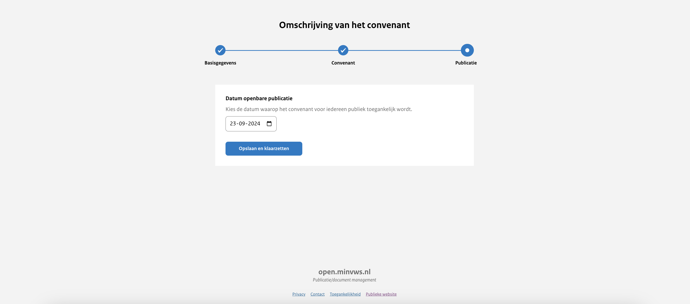

# Uploadstraat stap 3: Convenant publiceren

Datum openbare publicatie
: In deze stap heb je de mogelijkheid om te bepalen vanaf welk moment de publicatie openbaar en vindbaar is op het publicatieplatform.
Je kunt ervoor kiezen om het convenant onmiddellijk te publiceren. De publicatie krijgt dan de status 'Openbaar'. Het is ook
mogelijk om de publicatie in te plannen op een moment in de toekomst. Het convenant krijgt de status 'Publicatie gepland' in het uploadportaal
en wordt op het gekozen moment 'Openbaar'.

