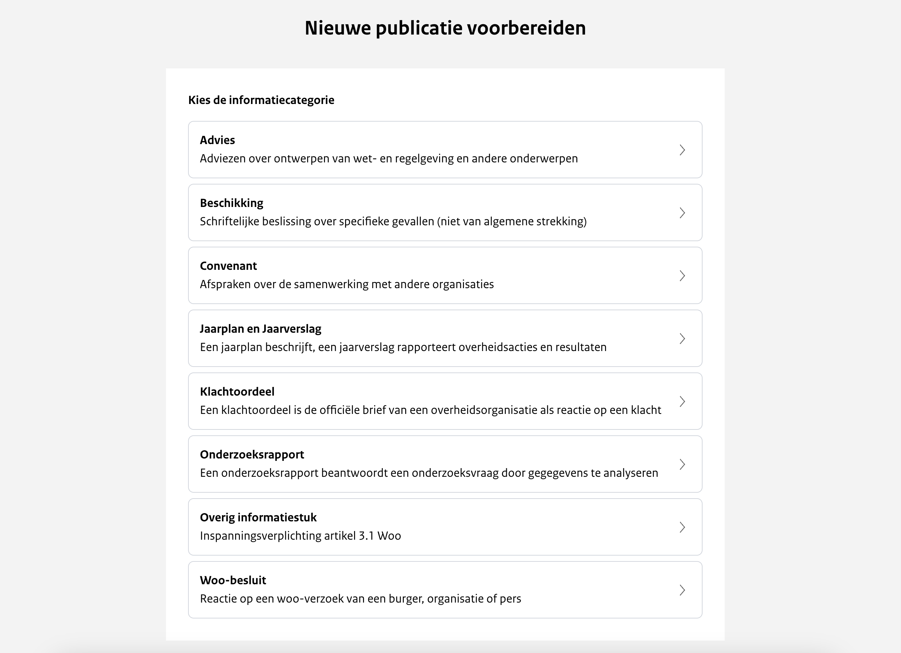

# Publiceren

In het uploadportaal bestaan er acht zogenoemde uploadstraten voor verschillende Woo-informatiecategorieën. De eerste stap
in het aanmaken van een nieuwe publicatie is het kiezen van de betreffende informatiecategorie waaronder de openbaar te
maken informatie valt. Zie onderstaande afbeelding.



Afhankelijk van de gekozen informatiecategorie opent de bijbehorende uploadstraat.
In de onderstaande pagina's wordt beschreven hoe je deze uploadstraten gebruikt.

Nadat een publicatie daadwerkelijk openbaar gemaakt is, wordt de metadata opgenomen in de zoekmachine van het publicatieplatform.
De publicatie en bijbehorende documenten kunnen zowel gevonden worden op basis van de metadata als op de inhoud van de documenten.

```{toctree}
:maxdepth: 1
:caption: Inhoudsopgave

advies/index
beschikking/index
convenant/index
jaarplan-en-jaarverslag/index
klachtenoordeel/index
onderzoeksrapport/index
overig-informatiestuk/index
woo-besluit/index
```
