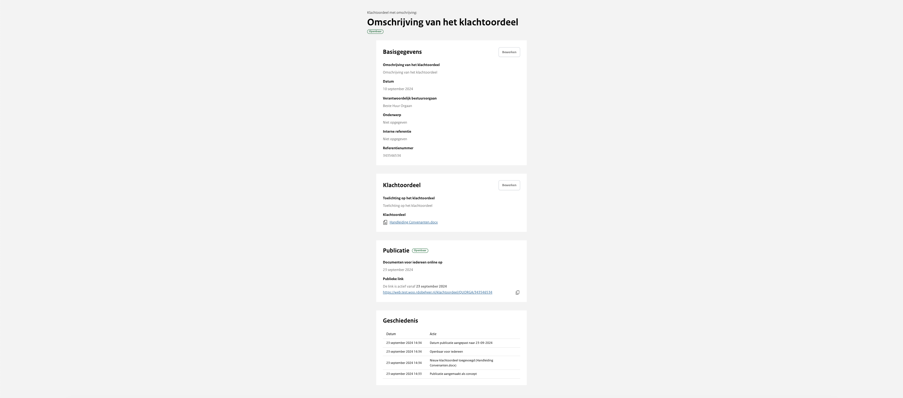

# Publicatie wijzigen

Om een klachtenoordeel te wijzigen ga je naar het overzicht ‘Alle publicaties’ en klik je op de desbetreffende publicatie.
Vanuit het overzicht van de publicatie is het mogelijk om de informatie te bewerken.

## Wijzigen voor de publicatie

Wanneer de publicatie is opgeslagen en nog niet de status ‘openbaar’ heeft, is het nog mogelijk om alles aan te passen of om
het hoofdbestand te verwijderen. Daarnaast kan je een klachtenoordeel verwijderen wanneer deze nog het label ‘concept’ heeft
door naar beneden te scrollen en onder het kopje ‘gevarenzone’ op ‘Klachtenoordeel verwijderen’ te klikken.

## Wijzigen na de publicatie

Zodra het klachtenoordeel openbaar is gemaakt blijft het mogelijk om indien nodig wijzigingen aan te brengen, het is dan niet
meer mogelijk het klachtenoordeel te verwijderen. Wel is het mogelijk om het document te vervangen door een nieuwe versie van
het document. Als je na de publicatie aanpassingen doet aan het klachtenoordeel worden deze geregistreerd in de geschiedenis
van de publicatie. Deze geschiedenis is openbaar terug te vinden op de pagina van het klachtenoordeel.
