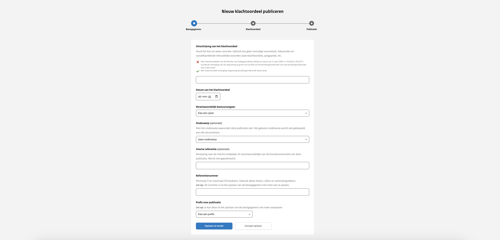

# Stap 1: Basisgegevens

## Omschrijving

Voer een korte en concrete omschrijving in, zonder onnodige voorzetsels, lidwoorden of vanzelfsprekende termen zoals 'Klachtenoordeel'
en ‘aangaande’. Deze omschrijving verschijnt als titel op de website en is verplicht om in te vullen.

## Datum van het Klachtenoordeel

Gebruik hier de datum die in het klachtenoordeel wordt vermeld. Het invullen van dit veld is verplicht.

## Verantwoordelijk bestuursorgaan

Kies uit het dropdown-menu het bestuursorgaan dat verantwoordelijk is voor deze publicatie. Indien er slechts één optie beschikbaar
is, wordt deze automatisch geselecteerd. Je kunt alleen publiceren namens een bestuursorgaan dat aan je organisatie is gekoppeld.
Dit veld is verplicht om in te vullen.

## Onderwerp

Kies een onderwerp uit de lijst die van toepassing is op deze publicatie. De onderwerpen worden beheerd door de organisatiebeheerder
van je organisatie. Dit veld is verplicht om in te vullen.

## Interne referentie

Gebruik dit vrij-invulbare veld voor interne verwijzingen, zoals de vindplaats van de oorspronkelijke brondocumentatie. Dit veld
wordt niet gepubliceerd en is optioneel.

## Referentienummer

Voer hier het referentienummer in, dat samen met de prefix een unieke identificatie binnen de organisatie moet vormen. Dit nummer
is cruciaal voor de indexering van de publicatie.

:::{admonition} Let op!
:class: attention
Na het opslaan van deze stap kun je het referentienummer niet meer aanpassen, dus voer het zorgvuldig in. Dit veld is verplicht om in te vullen.
:::

## Prefix voor publicatie

Kies een prefix uit het dropdown-menu, bestaande uit minimaal 5 karakters, die samen met het referentienummer zorgt voor een
unieke identificatie van de publicatie binnen de organisatie. De prefixes worden aangemaakt door de organisatiebeheerder van je organisatie.
Deze combinatie van prefix en referentienummer garandeert een uniek ID in de database. Als er slechts één optie beschikbaar is,
wordt deze automatisch geselecteerd. Dit veld is verplicht om in te vullen.
