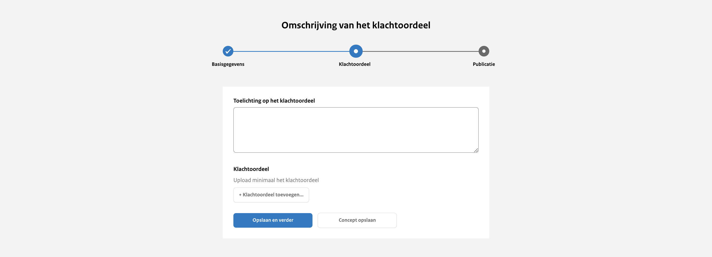

# Stap 2: Klachtenoordeel gegevens toevoegen

## Toelichting op het Klachtenoordeel

Hier schrijf je een beknopte beschrijving van de inhoud van het klachtenoordeel. Deze toelichting verschijnt bovenaan de pagina
en biedt een overzichtelijke introductie van de belangrijkste punten. Zorg ervoor dat de beschrijving helder en informatief is,
zodat lezers snel begrijpen waar het klachtenoordeel over gaat. Dit veld is verplicht om in te vullen.

## Klachtenoordeel toevoegen

### Bestand

Hier upload je maximaal 1 bestand van het type PDF, Excel, Word of PowerPoint.

### Referentienummer bestand

Dit is een optioneel tekstveld. Bijvoorbeeld een verwijzing naar de interne vindplaats of verantwoordelijke van het document.
Wordt niet getoond op de website.

### Taal van het document

Keuze uit Nederlands (standaard ingevuld) of Engels.

### Formele datum

De datum die wordt gehanteerd in het klachtenoordeel.

### Weigeringsgronden

Wanneer gegevens in het document gelakt zijn, zijn hiervoor weigeringsgronden gebruikt uit de Wet open overheid. Kies indien
van toepassing welke weigeringsgronden gebruikt zijn. Dit is een standaardlijst met weigeringsgronden waar je uit kan kiezen.

