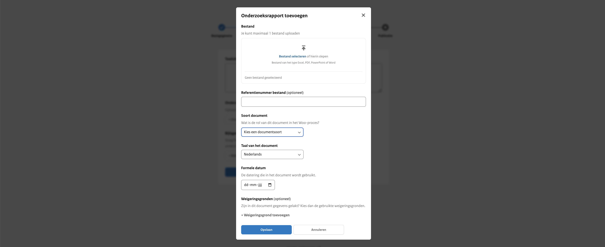
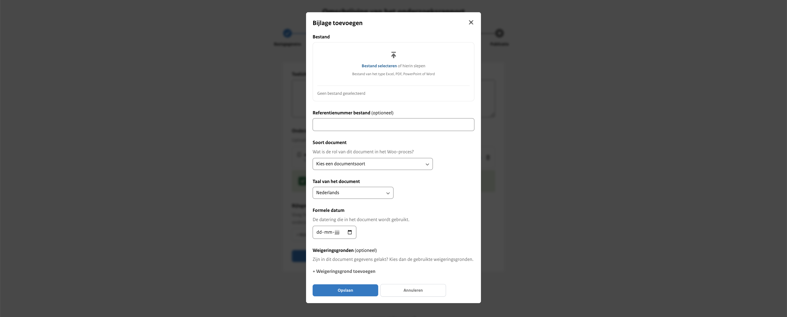

<!-- markdownlint-disable MD024 -->

# Stap 2: Onderzoeksrapport gegevens

## Toelichting op het onderzoeksrapport

Hier geef je een beknopte beschrijving van de inhoud van het onderzoeksrapport. Deze toelichting verschijnt bovenaan op de
website en biedt een overzichtelijke introductie van de belangrijkste punten. Zorg ervoor dat de beschrijving helder en informatief
is, zodat lezers snel begrijpen waar het onderzoeksrapport over gaat. Dit veld is verplicht om in te vullen.

## Het onderzoeksrapport

Upload hier het hoofddocument van het onderzoeksrapport. Dit veld is verplicht om verder te gaan.

:::{admonition} Let op!
:class: warning
Je kunt slechts één document uploaden.
:::

### Bestand

Hier upload je maximaal één  bestand van het type PDF, Excel, Word of PowerPoint.

### Soort document

Dit is een dropdown menu waar je kiest uit het soort van het desbetreffende rapport dat je gaat uploaden. De opties zijn:
ambtsbericht, evaluatierapport, inspectierapport, onderzoeksrapport, verantwoordingsrapport en voortgangsrapport.

### Referentienummer bestand

Dit is een invulveld dat optioneel is om te vullen. Bijvoorbeeld een verwijzing naar de interne vindplaats of verantwoordelijke
van het document. Wordt niet getoond op de website.

### Taal van het document

Keuze uit Nederlands (standaard ingevuld) of Engels.

### Formele datum

De datum die wordt gehanteerd in het onderzoeksrapport.

### Weigeringsgronden

Wanneer gegevens in het document gelakt zijn, zijn hiervoor weigeringsgronden gebruikt uit de Wet open overheid. Selecteer
indien van toepassing welke weigeringsgronden gebruikt zijn. Dit is een standaardlijst met weigeringsgronden waar je uit kan kiezen.

## Bijlage

Wanneer er aanvullende informatie beschikbaar is gerelateerd aan het onderzoeksrapport of wanneer er bij het onderzoeksrapport
aanvullende informatie beschikbaar is die niet in het 'hoofddocument' voorkomt, is het mogelijk om een bijlage toe te voegen.

### Bestand

Hier upload je maximaal één bestand van het type PDF, Excel, Word of PowerPoint.

### Referentienummer bestand

Dit is een vrij invulveld. Bijvoorbeeld een verwijzing naar de interne vindplaats of verantwoordelijke van het document.
Wordt niet getoond op de website.

### Soort document

Je geeft hier aan wat voor soort document dat de bijlage is. Dit is een standaard lijst met documentsoorten waar je uit kan kiezen.

### Taal van het document

Keuze uit Nederlands (standaard ingevuld) of Engels.

### Formele datum

De datum die wordt gehanteerd in het onderzoeksrapport.

### Weigeringsgronden

Hier selecteer je de weigeringsgrond die zijn gebruikt in het document om gegevens te lakken op basis van de Wet open overheid.
Dit is een standaardlijst met weigeringsgronden waar je uit kan kiezen.

