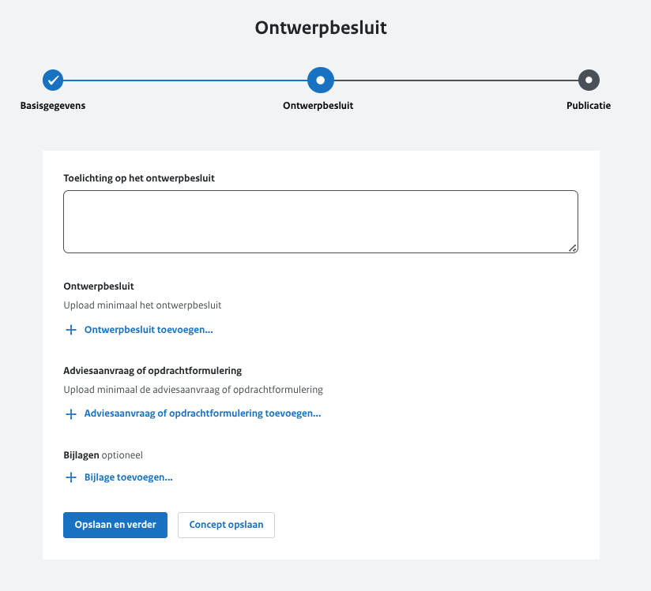
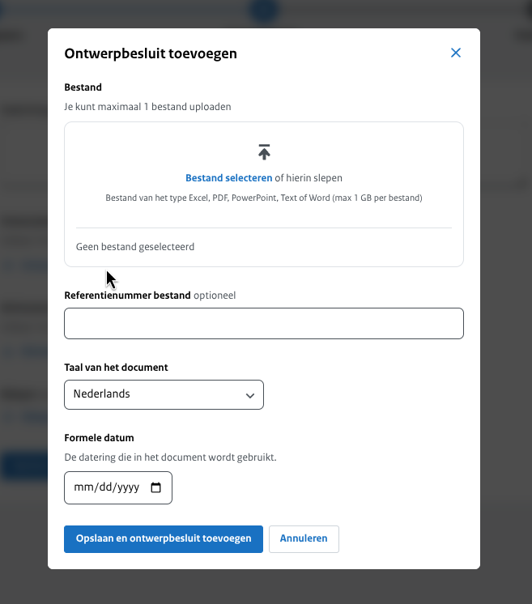
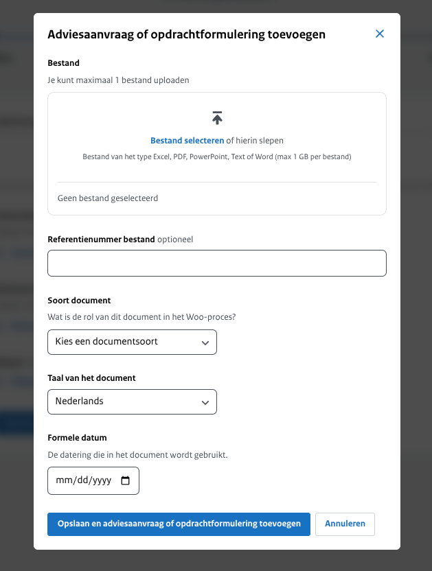
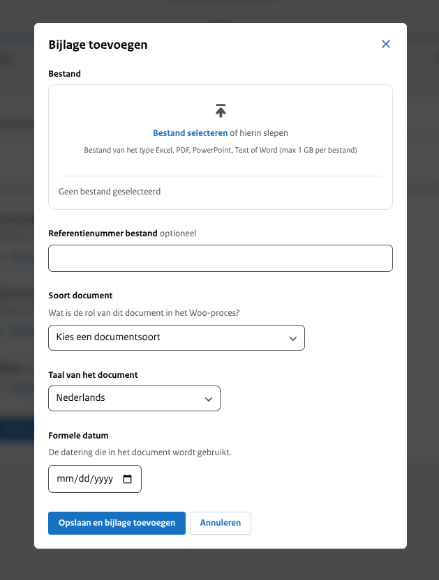

<!-- markdownlint-disable MD024 -->

# Stap 2: Ontwerpbesluit gegevens

## Toelichting op het ontwerpbesluit

Hier geef je een beknopte beschrijving van de inhoud van het ontwerpbesluit. Deze toelichting verschijnt bovenaan op de website
en biedt een overzichtelijke introductie van de belangrijkste punten. Zorg ervoor dat de beschrijving helder en informatief is,
zodat lezers snel begrijpen waar het ontwerpbesluit over gaat. Dit veld is verplicht om in te vullen.

## Ontwerpbesluit

### Bestand

Hier upload je maximaal één bestand van het type PDF, Excel, Word of PowerPoint.

:::{admonition} Let op!
:class: warning
Je kunt slechts één document uploaden.
:::

### Referentienummer bestand

Dit is een vrij invulveld dat optioneel is om te vullen. Bijvoorbeeld een verwijzing naar de interne vindplaats of verantwoordelijke
van het document. Wordt niet getoond op de website.

### Taal van het document

Keuze uit Nederlands (standaard ingevuld) of Engels.

### Formele datum

De datum die wordt gehanteerd in het ontwerpbesluit.

## Adviesaanvraag

### Bestand

Hier upload je maximaal 1 bestand van het type PDF, Excel, Word of PowerPoint.

:::{admonition} Let op!
:class: warning
Je kunt slechts één document uploaden.
:::

### Referentienummer bestand

Dit is een vrij invulveld. Bijvoorbeeld een verwijzing naar de interne vindplaats of verantwoordelijke van de ontwerpbesluitaanvraag.
Wordt niet getoond op de website.

### Taal van het document

Keuze uit Nederlands (standaard ingevuld) of Engels

### Formele datum

De datum die wordt gehanteerd in de ontwerpbesluitaanvraag.

## Bijlage

Wanneer er aanvullende informatie beschikbaar is gerelateerd aan het ontwerpbesluit of wanneer er bij het ontwerpbesluit aanvullende
informatie beschikbaar is die niet in het 'hoofddocument' of de 'ontwerpbesluitaanvraag' voorkomt, is het mogelijk om een bijlage toe te voegen.

### Bestand

Hier upload je maximaal 1 bestand van het type PDF, Excel, Word of PowerPoint.

### Referentienummer bestand

Dit is een vrij invulveld. Bijvoorbeeld een verwijzing naar de interne vindplaats of verantwoordelijke van het document.
Wordt niet getoond op de website.

### Soort document

Je geeft hier aan wat voor soort document dat de bijlage is. Dit is een standaard lijst met documentsoorten waar je uit kan kiezen.

### Taal van het document

Keuze uit Nederlands (standaard ingevuld) of Engels

### Formele datum

De datum die wordt gehanteerd in de bijlage.
