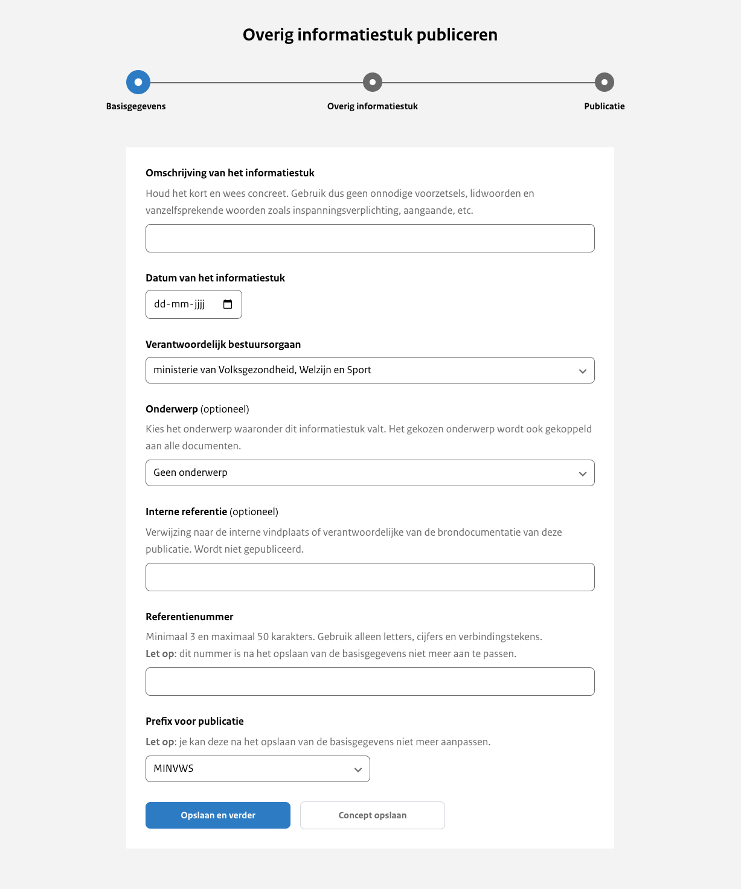

# Stap 1: Basisgegevens

## Omschrijving

In de omschrijving van het informatiestuk gebruik je geen onnodige voorzetsels, lidwoorden of vanzelfsprekende inhoudelijke woorden
zoals 'informatiestuk' en 'aangaande'.
Deze omschrijving wordt als titel op de website getoond. Dit veld is verplicht om in te vullen.

## Datum van het informatiestuk

Gebruik hier de datum die in het informatiestuk wordt vermeld. Het invullen van dit veld is verplicht.

## Verantwoordelijk bestuursorgaan

Kies uit het dropdown-menu het bestuursorgaan dat verantwoordelijk is voor deze publicatie. Is er slechts één keuze, dan is
deze optie voor je geselecteerd.

Het is alleen mogelijk om namens een bestuursorgaan te publiceren dat aan je organisatie  is gekoppeld. Een bestuursorgaan
kan aan meerdere organisaties gekoppeld worden. Dit veld is verplicht om in te vullen.

## Onderwerp

Hier selecteer je een onderwerp uit een lijst van onderwerpen die van toepassing zijn op deze publicatie. De onderwerpen worden
aangemaakt door de organisatiebeheerder van je organisatie.

## Interne referentie

De interne referentie is een vrij invulbaar veld dat niet wordt gepubliceerd. Je kan dit veld bijvoorbeeld gebruiken ter
verwijzing naar de vindplaats van de oorspronkelijke brondocumentatie.

## Referentienummer

Voer hier het referentienummer in, dat samen met de prefix een unieke identificatie binnen de organisatie moet vormen. Dit nummer
is cruciaal voor de indexering van de publicatie. Dit veld is verplicht om in te vullen.

:::{admonition} Let op!
:class: warning
Na het opslaan van deze stap kun je het referentienummer niet meer aanpassen, dus voer het zorgvuldig in.
:::

## Prefix

Kies uit het dropdown-menu een prefix. Is er slechts één keuze, dan is deze optie voor je geselecteerd. De combinatie van
prefix en referentienummer moet uniek zijn binnen de organisatie. De prefixes worden aangemaakt door de organisatiebeheerder van je organisatie.

:::{admonition} Let op!
:class: warning
Het is niet mogelijk om de prefix te wijzigen, nadat je deze hebt opgeslagen.
:::
