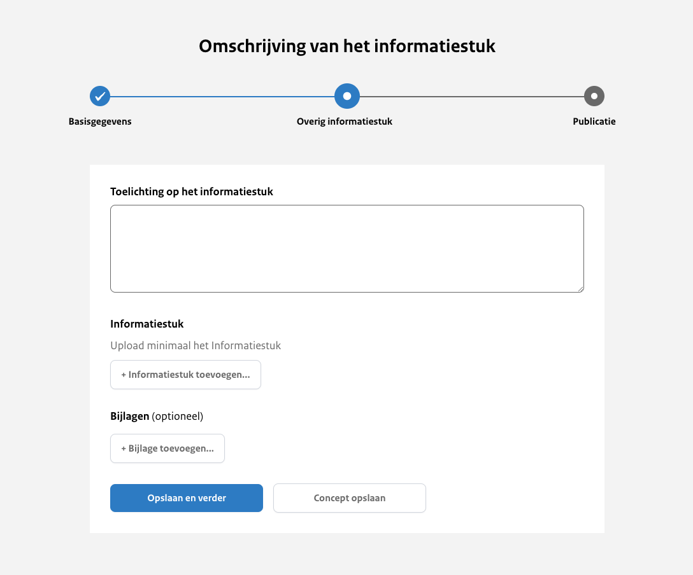
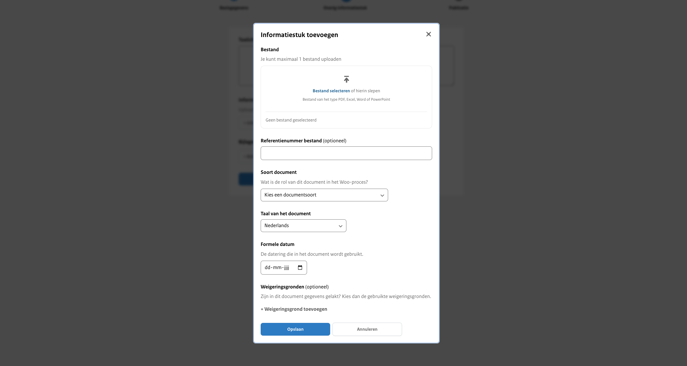
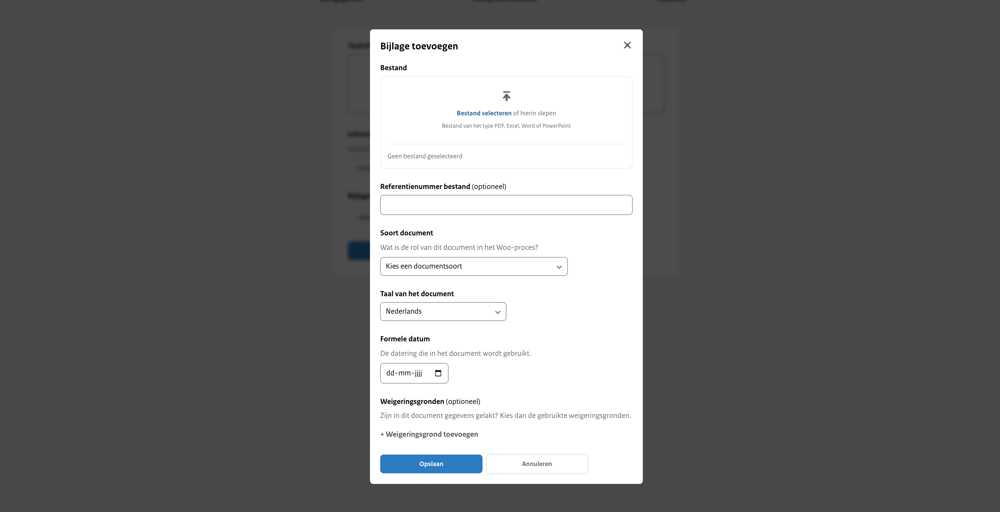

# Uploadstraat stap 2: Overig informatiestuk gegevens

Toelichting op het informatiestuk
: Hier geef je een beknopte beschrijving van de inhoud van het informatiestuk. Deze toelichting verschijnt bovenaan op de website
en biedt een overzichtelijke introductie van de belangrijkste punten. Zorg ervoor dat de beschrijving helder en informatief is,
zodat lezers snel begrijpen waar het informatiestuk over gaat. Dit veld is verplicht om in te vullen.

## Informatiestuk

Upload hier het hoofddocument van het informatiestuk. Dit veld is verplicht om verder te gaan.

:::{admonition} Let op!
:class: attention
Je kunt slechts één document uploaden.
:::

Bestand
: Hier upload je maximaal één bestand van het type PDF, Excel, Word of PowerPoint.

Referentienummer bestand
: Dit is een vrij invulveld dat optioneel is om te vullen. Bijvoorbeeld een verwijzing naar de interne vindplaats of verantwoordelijke
van het document. Wordt niet getoond op de website.

Taal van het document
: Keuze uit Nederlands (standaard ingevuld) of Engels.

Formele datum
: De datum die wordt gehanteerd in het informatiestuk.

Weigeringsgronden
: Wanneer gegevens in het document gelakt zijn, zijn hiervoor weigeringsgronden gebruikt uit de Wet open overheid. Selecteer
indien van toepassing welke weigeringsgronden gebruikt zijn. Dit is een standaardlijst met weigeringsgronden waar je uit kan kiezen.

## Bijlage

Wanneer er aanvullende informatie beschikbaar is gerelateerd aan het informatiestuk of wanneer er bij het informatiestuk aanvullende
informatie beschikbaar is die niet in het 'hoofddocument' voorkomt, is het mogelijk om een bijlage toe te voegen.

Bestand
: Hier upload je maximaal 1 bestand van het type PDF, Excel, Word of PowerPoint.

Referentienummer bestand
: Dit is een vrij invulveld. Bijvoorbeeld een verwijzing naar de interne vindplaats of verantwoordelijke van het document.
Wordt niet getoond op de website.

Soort document
: Je geeft hier aan wat voor soort document het is. Dit is een standaard lijst met documentsoorten waar je uit kan kiezen.

Taal van het document
: Keuze uit Nederlands (standaard ingevuld) of Engels

Formele datum
: De datum die wordt gehanteerd in het document.

Weigeringsgronden
: De weigeringsgrond(en) die is/zijn gebruikt in het document om gegevens te lakken afkomstig uit de Wet open overheid. Dit is
een standaardlijst met weigeringsgronden waar je uit kan kiezen.

