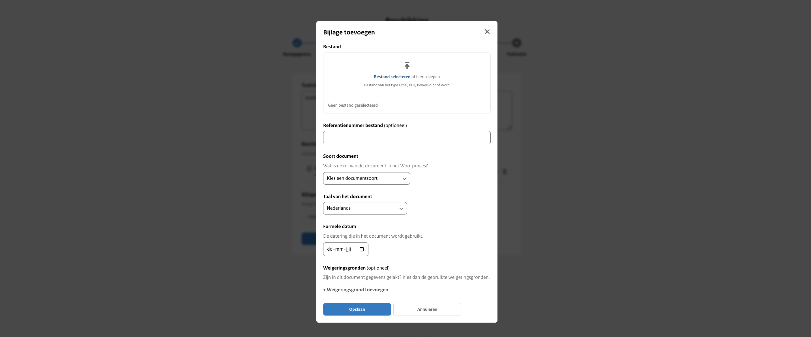

# Metadata per document

Naast de metadata behorend bij de publicatie, zoals is beschreven in hoofdstuk 5, is er ook metadata behorend bij ieder geüpload
document. Dit geldt voor documenten die worden geüpload bij alle informatiecategorieën, met uitzondering van de documenten
die openbaar worden gemaakt onder een Woo-besluit. Deze informatie kan je helpen bij het voorbereiden van de organisatie
op het publiceren van informatie op het publicatieplatform.

Nadat een publicatie (inclusief documenten) daadwerkelijk openbaar gemaakt is, wordt de metadata opgenomen in de zoekmachine
van het publicatieplatform. De publicatie en bijbehorende documenten kunnen zowel gevonden worden op basis van de metadata als op de
inhoud van de documenten.

