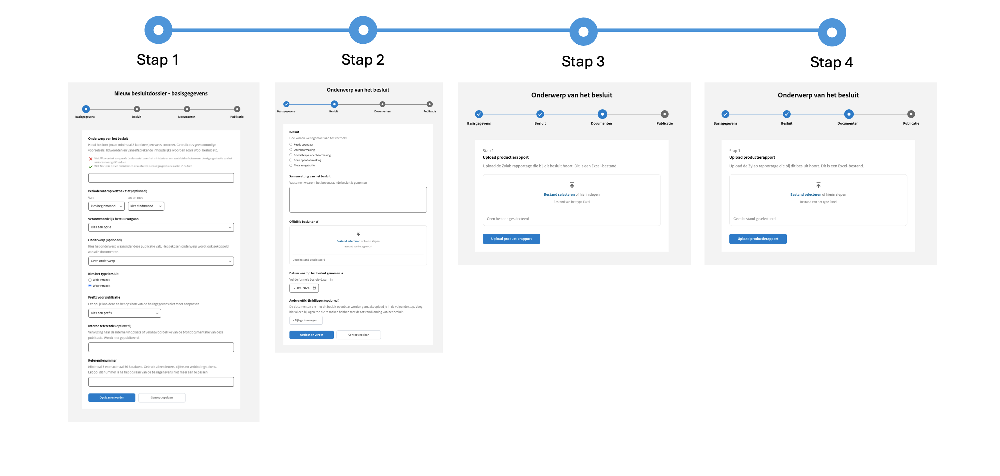

# Metadata per informatiecategorie

In het uploadportaal bestaan er acht zogenoemde uploadstraten voor verschillende Woo-informatiecategorieën. De eerste stap
in het aanmaken van een nieuwe publicatie is het kiezen van de betreffende informatiecategorie waaronder de openbaar te
maken informatie valt. Zie onderstaande afbeelding.

Afhankelijk van de gekozen informatiecategorie opent de bijbehorende uploadstraat. In deze uploadstraat wordt gevraagd
naar specifieke informatie, ook wel metadata genoemd. De metadata behorend bij de publicatie wordt per informatiecategorie
beschreven in dit hoofdstuk. Deze informatie kan je helpen bij het voorbereiden van de organisatie op het publiceren van
informatie op het publicatieplatform.
Nadat een publicatie daadwerkelijk openbaar gemaakt is, wordt de metadata opgenomen in de zoekmachine van het publicatieplatform.
De publicatie en bijbehorende documenten kunnen zowel gevonden worden op basis van de metadata als op de inhoud van de documenten.

In het volgende hoofdstuk wordt beschreven welke metadata gevraagd wordt bij ieder document dat geüpload wordt.

## Advies

De uploadstraat voor een Advies publicatie bestaat uit drie stappen: basisgegevens, gegevens over het advies en de publicatiedatum.

### Basisgegevens Advies

De basisgegevens (metadata) van de publicatie vul je in stap 1 van de uploadstraat in.

| Naam                            | Vereist | Toelichting                                                                                                                                                                |
|---------------------------------|---------|----------------------------------------------------------------------------------------------------------------------------------------------------------------------------|
| Omschrijving van het advies     | Ja      | Vrij invulveld, minimaal 2 karakters. Houd het kort en wees concreet. Wordt getoond als titel op de website.                                                               |
| Datum van het advies            | Ja      | -                                                                                                                                                                          |
| Verantwoordelijk bestuursorgaan | Ja      | Het bestuursorgaan dat verantwoordelijk is voor het advies. Keuze uit een dropdownmenu.                                                                                    |
| Onderwerp                       | Nee     | Kies het onderwerp waaronder dit advies valt.                                                                                                                              |
| Interne referentie              | Nee     | Vrij invulveld. Bijvoorbeeld een verwijzing naar de interne vindplaats of verantwoordelijke van de brondocumentatie van deze publicatie. Wordt niet getoond op de website. |
| Referentienummer                | Ja      | Vrij invulveld, 3-50 karakters. Gebruik letters, cijfers en/of verbindingstekens. Uniek binnen de organisatie. Maakt samen met de prefix het ID van de publicatie uniek.   |
| Prefix                          | Ja      | Keuze uit een dropdownmenu. Maakt samen met het referentienummer het ID van de publicatie uniek in de database.                                                            |

### Gegevens over het Advies

De gegevens over het advies (metadata) vul je in stap 2 van de uploadstraat in.

| Naam                      | Vereist | Toelichting                                                                                                                         |
|---------------------------|---------|-------------------------------------------------------------------------------------------------------------------------------------|
| Toelichting op het advies | Ja      | Vrij invulveld, minimaal 1 karakter. Een korte toelichting op de inhoud van het advies. Wordt getoond onder de titel op de website. |
| Advies                    | Ja      | Upload het advies, maximaal 1 bestand. Meer informatie over de metadata van het bestand lees je in hoofdstuk 6.                     |
| Adviesaanvraag            | Nee     | Mogelijkheid om het adviesaanvraag document te uploaden die hoort bij het advies.                                                   |
| Bijlagen                  | Nee     | Mogelijkheid om één of meerdere bijlagen te uploaden die horen bij het advies.                                                      |

## Beschikkingen

De uploadstraat voor Beschikkingen bestaat uit drie stappen: basisgegevens, gegevens over de beschikking en de publicatiedatum.
Onderstaande afbeeldingen tonen hoe de uploadstraat eruitziet.

### Basisgegevens Beschikkingen

De basisgegevens (metadata) van de publicatie vul je in stap 1 van de uploadstraat in.

| Naam                            | Vereist | Toelichting                                                                                                                                                                |
| ------------------------------- | ------- | -------------------------------------------------------------------------------------------------------------------------------------------------------------------------- |
| Omschrijving van de beschikking | Ja      | Vrij invulveld, minimaal 2 karakters. Houd het kort en wees concreet. Wordt getoond als titel op de website.                                                               |
| Datum van de beschikking        | Ja      | -                                                                                                                                                                          |
| Verantwoordelijk bestuursorgaan | Ja      | Het bestuursorgaan dat verantwoordelijk is voor de beschikking. Keuze uit een dropdownmenu.                                                                                |
| Onderwerp                       | Nee     | Het onderwerp waar de beschikking aan gekoppeld wordt. Keuze uit een dropdownmenu.                                                                                         |
| Interne referentie              | Nee     | Vrij invulveld. Bijvoorbeeld een verwijzing naar de interne vindplaats of verantwoordelijke van de brondocumentatie van deze publicatie. Wordt niet getoond op de website. |
| Referentienummer                | Ja      | Vrij invulveld, 3-50 karakters. Gebruik letters, cijfers en/of verbindingstekens. Uniek binnen de organisatie. Maakt samen met de prefix het ID van de publicatie uniek.   |
| Prefix                          | Ja      | Keuze uit een dropdownmenu. Maakt samen met het referentienummer het ID van de publicatie uniek in de database.                                                            |

### Gegevens over de beschikking

De gegevens over de beschikking (metadata) vul je in stap 2 van de uploadstraat in.

| Naam                          | Vereist | Toelichting                                                                                                                             |
| ----------------------------- |---------| --------------------------------------------------------------------------------------------------------------------------------------- |
| Toelichting op de beschikking | Ja      | Vrij invulveld, minimaal 1 karakter. Een korte toelichting op de inhoud van de beschikking. Wordt getoond onder de titel op de website. |
| Beschikking                   | Ja      | Upload de beschikking, maximaal 1 bestand. Meer informatie over de metadata van het bestand lees je in hoofdstuk 6.                     |
| Bijlagen                      | Nee     | Mogelijkheid om één of meerdere bijlagen te uploaden die horen bij de beschikking.                                                      |

## Convenanten

De uploadstraat voor Convenanten bestaat uit drie stappen: basisgegevens, gegevens over het convenant en de publicatiedatum.
Onderstaande afbeeldingen tonen hoe de uploadstraat eruitziet.

### Basisgegevens Convenanten

De basisgegevens (metadata) van de publicatie vul je in stap 1 van de uploadstraat in.

| Naam                            | Vereist | Toelichting                                                                                                                                                                |
| ------------------------------- | ------- | -------------------------------------------------------------------------------------------------------------------------------------------------------------------------- |
| Omschrijving van het convenant  | Ja      | Vrij invulveld, minimaal 2 karakters. Houd het kort en wees concreet. Wordt getoond als titel op de website.                                                               |
| Datum van het convenant         | Ja      | -                                                                                                                                                                          |
| Verantwoordelijk bestuursorgaan | Ja      | Het bestuursorgaan dat verantwoordelijk is voor het convenant. Keuze uit een dropdownmenu.                                                                                 |
| Onderwerp                       | Nee     | Het onderwerp waar het convenant aan gekoppeld wordt. Keuze uit een dropdownmenu.                                                                                          |
| Interne referentie              | Nee     | Vrij invulveld. Bijvoorbeeld een verwijzing naar de interne vindplaats of verantwoordelijke van de brondocumentatie van deze publicatie. Wordt niet getoond op de website. |
| Referentienummer                | Ja      | Vrij invulveld, 3-50 karakters. Gebruik letters, cijfers en/of verbindingstekens. Uniek binnen de organisatie. Maakt samen met de prefix het ID van de publicatie uniek.   |
| Prefix                          | Ja      | Keuze uit een dropdownmenu. Maakt samen met het referentienummer het ID van de publicatie uniek in de database.                                                            |

### Gegevens over het convenant

De gegevens over het convenant (metadata) vul je in stap 2 van de uploadstraat in.

| Naam                         | Vereist | Toelichting                                                                                                                            |
| ---------------------------- | ------- | -------------------------------------------------------------------------------------------------------------------------------------- |
| Partijen in het convenant    | Ja      | Minimaal 2 partijen. Keuze uit een dropdownmenu met bestuursorganen en mogelijkheid tot vrije invoer.                                  |
| Toelichting op het convenant | Ja      | Vrij invulveld, minimaal 1 karakter. Een korte toelichting op de inhoud van het convenant. Wordt getoond onder de titel op de website. |
| Convenant                    | Ja      | Upload het convenant, maximaal 1 bestand. Meer informatie over de metadata van het bestand lees je in hoofdstuk 6.                     |
| Opvolger van vorig convenant | Nee     | Een link naar de publicatie waar dit convenant een relatie mee heeft.                                                                  |
| Bijlagen                     | Nee     | Mogelijkheid om één of meerdere bijlagen te uploaden die horen bij het convenant.                                                      |

## Jaarplannen en Jaarverslagen

De uploadstraat voor Jaarplannen en Jaarverslagen bestaat uit drie stappen: basisgegevens, gegevens over het jaarplan of jaarverslag
en de publicatiedatum. Onderstaande afbeeldingen tonen hoe de uploadstraat eruitziet.

### Basisgegevens Jaarplannen en Jaarverslagen

De basisgegevens (metadata) van de publicatie vul je in stap 1 van de uploadstraat in.

| Naam                                         | Vereist | Toelichting                                                                                                                                                                |
| -------------------------------------------- | ------- | -------------------------------------------------------------------------------------------------------------------------------------------------------------------------- |
| Omschrijving van het jaarplan of jaarverslag | Ja      | Vrij invulveld, minimaal 2 karakters. Houd het kort en wees concreet. Wordt getoond als titel op de website.                                                               |
| Datum van het jaarplan of jaarverslag        | Ja      | Het bestuursorgaan dat verantwoordelijk is voor het jaarplan/-verslag. Keuze uit een dropdownmenu.                                                                         |
| Verantwoordelijk bestuursorgaan              | Ja      | Het onderwerp waar het jaarplan/-verslag aan gekoppeld wordt. Keuze uit een dropdownmenu.                                                                                  |
| Onderwerp                                    | Nee     | Het onderwerp waar het jaarplan/-verslag  aan gekoppeld wordt. Keuze uit een dropdownmenu.                                                                                 |
| Interne referentie                           | Nee     | Vrij invulveld. Bijvoorbeeld een verwijzing naar de interne vindplaats of verantwoordelijke van de brondocumentatie van deze publicatie. Wordt niet getoond op de website. |
| Referentienummer                             | Ja      | Vrij invulveld, 3-50 karakters. Gebruik letters, cijfers en/of verbindingstekens. Uniek binnen de organisatie. Maakt samen met de prefix het ID van de publicatie uniek.   |
| Prefix                                       | Ja      | Keuze uit een dropdownmenu. Maakt samen met het referentienummer het ID van de publicatie uniek in de database.                                                            |

### Gegevens over het jaarplan of jaarverslag

De gegevens over het jaarplan of jaarverslag (metadata) vul je in stap 2 van de uploadstraat in.

| Naam                                       | Vereist | Toelichting                                                                                                                                          |
| ------------------------------------------ |---------| ---------------------------------------------------------------------------------------------------------------------------------------------------- |
| Toelichting op het jaarplan of jaarverslag | Ja      | Vrij invulveld, minimaal 1 karakter. Een korte toelichting op de inhoud van het jaarplan of jaarverslag. Wordt getoond onder de titel op de website. |
| Jaarplan of jaarverslag                    | Ja      | Upload het jaarplan of jaarverslag, maximaal 1 bestand. Meer informatie over de metadata van het bestand lees je in hoofdstuk 6.                     |
| Bijlagen                                   | Nee     | Mogelijkheid om één of meerdere bijlagen te uploaden die horen bij het jaarplan of jaarverslag.                                                      |

## Klachtenoordelen

De uploadstraat voor Klachtoordelen bestaat uit drie stappen: basisgegevens, gegevens over het klachtoordeel en de publicatiedatum. Onderstaande afbeeldingen tonen hoe de uploadstraat eruitziet.

### Basisgegevens Klachtenoordelen

De basisgegevens (metadata) van de publicatie vul je in stap 1 van de uploadstraat in.

| Naam                                 | Vereist | Toelichting                                                                                                                                                                |
| ------------------------------------ | ------- | -------------------------------------------------------------------------------------------------------------------------------------------------------------------------- |
| Omschrijving van het klachtenoordeel | Ja      | Vrij invulveld, minimaal 2 karakters. Houd het kort en wees concreet. Wordt getoond als titel op de website.                                                               |
| Datum van het klachtenoordeel        | Ja      | Het bestuursorgaan dat verantwoordelijk is voor het klachtenoordeel. Keuze uit een dropdownmenu.                                                                           |
| Verantwoordelijk bestuursorgaan      | Ja      | Het onderwerp waar het klachtenoordeel aan gekoppeld wordt. Keuze uit een dropdownmenu.                                                                                    |
| Onderwerp                            | Nee     | Het onderwerp waar het klachtenoordeel aan gekoppeld wordt. Keuze uit een dropdownmenu.                                                                                    |
| Interne referentie                   | Nee     | Vrij invulveld. Bijvoorbeeld een verwijzing naar de interne vindplaats of verantwoordelijke van de brondocumentatie van deze publicatie. Wordt niet getoond op de website. |
| Referentienummer                     | Ja      | Vrij invulveld, 3-50 karakters. Gebruik letters, cijfers en/of verbindingstekens. Uniek binnen de organisatie. Maakt samen met de prefix het ID van de publicatie uniek.   |
| Prefix                               | Ja      | Keuze uit een dropdownmenu. Maakt samen met het referentienummer het ID van de publicatie uniek in de database.                                                            |

### Gegevens over het klachtoordeel

De gegevens over het klachtoordeel (metadata) vul je in stap 2 van de uploadstraat in.

| Naam                             | Vereist | Toelichting                                                                                                                                |
| -------------------------------- | ------- | ------------------------------------------------------------------------------------------------------------------------------------------ |
| Toelichting op het klachtoordeel | Ja      | Vrij invulveld, minimaal 1 karakter. Een korte toelichting op de inhoud van het klachtoordeel. Wordt getoond onder de titel op de website. |
| Klachtoordeel                    | Ja      | Upload het klachtoordeel, maximaal 1 bestand. Meer informatie over de metadata van het bestand lees je in hoofdstuk 6.                     |

## Onderzoeksrapporten

De uploadstraat voor Onderzoeksrapporten bestaat uit drie stappen: basisgegevens, gegevens over het onderzoeksrapport en de
publicatiedatum. Onderstaande afbeeldingen tonen hoe de uploadstraat eruitziet.

### Basisgegevens Onderzoeksrapporten

De basisgegevens (metadata) van de publicatie vul je in stap 1 van de uploadstraat in.

| Naam                                   | Vereist | Toelichting                                                                                                                                                                |
| -------------------------------------- | ------- | -------------------------------------------------------------------------------------------------------------------------------------------------------------------------- |
| Omschrijving van het onderzoeksrapport | Ja      | Vrij invulveld, minimaal 2 karakters. Houd het kort en wees concreet. Wordt getoond als titel op de website.                                                               |
| Datum van het onderzoeksrapport        | Ja      | -                                                                                                                                                                          |
| Verantwoordelijk bestuursorgaan        | Ja      | Het bestuursorgaan dat verantwoordelijk is voor het onderzoeksrapport. Keuze uit een dropdownmenu.                                                                         |
| Onderwerp                              | Nee     | Het onderwerp waar het onderzoeksrapport aan gekoppeld wordt. Keuze uit een dropdownmenu.                                                                                  |
| Interne referentie                     | Nee     | Vrij invulveld. Bijvoorbeeld een verwijzing naar de interne vindplaats of verantwoordelijke van de brondocumentatie van deze publicatie. Wordt niet getoond op de website. |
| Referentienummer                       | Ja      | Vrij invulveld, 3-50 karakters. Gebruik letters, cijfers en/of verbindingstekens. Uniek binnen de organisatie. Maakt samen met de prefix het ID van de publicatie uniek.   |
| Prefix                                 | Ja      | Keuze uit een dropdownmenu. Maakt samen met het referentienummer het ID van de publicatie uniek in de database.                                                            |

### Gegevens over het onderzoekrapport

De gegevens over het onderzoeksrapport(metadata) vul je in stap 2 van de uploadstraat in.

| Naam                                 | Vereist | Toelichting                                                                                                                                    |
| ------------------------------------ | ------- | ---------------------------------------------------------------------------------------------------------------------------------------------- |
| Toelichting op het onderzoeksrapport | Ja      | Vrij invulveld, minimaal 1 karakter. Een korte toelichting op de inhoud van het onderzoeksrapport. Wordt getoond onder de titel op de website. |
| Onderzoeksrapport                    | Ja      | Upload het onderzoeksrapport, maximaal 1 bestand. Meer informatie over de metadata van het bestand lees je in hoofdstuk 6.                     |
| Bijlagen                             | Nee     | Mogelijkheid om één of meerdere bijlagen te uploaden die horen bij het onderzoeksrapport..                                                     |

## Overig informatiestuk

De uploadstraat voor Overige informatiestukken bestaat uit drie stappen: basisgegevens, gegevens over het informatiestuk en de publicatiedatum.

### Basisgegevens Overig informatiestuk

De basisgegevens (metadata) van de publicatie vul je in stap 1 van de uploadstraat in.

| Naam                                       | Vereist | Toelichting                                                                                                                                                                |
|--------------------------------------------|---------|----------------------------------------------------------------------------------------------------------------------------------------------------------------------------|
| Omschrijving van het overig informatiestuk | Ja      | Vrij invulveld, minimaal 2 karakters. Houd het kort en wees concreet. Wordt getoond als titel op de website.                                                               |
| Datum van het informatiestuk               | Ja      | -                                                                                                                                                                          |
| Verantwoordelijk bestuursorgaan            | Ja      | Het bestuursorgaan dat verantwoordelijk is voor het informatiestuk. Keuze uit een dropdownmenu.                                                                            |
| Onderwerp                                  | Nee     | Het onderwerp waar het informatiestuk aan gekoppeld wordt. Keuze uit een dropdownmenu.                                                                                     |
| Interne referentie                         | Nee     | Vrij invulveld. Bijvoorbeeld een verwijzing naar de interne vindplaats of verantwoordelijke van de brondocumentatie van deze publicatie. Wordt niet getoond op de website. |
| Referentienummer                           | Ja      | Vrij invulveld, 3-50 karakters. Gebruik letters, cijfers en/of verbindingstekens. Uniek binnen de organisatie. Maakt samen met de prefix het ID van de publicatie uniek.   |
| Prefix                                     | Ja      | Keuze uit een dropdownmenu. Maakt samen met het referentienummer het ID van de publicatie uniek in de database.                                                            |

### Gegevens over het overige informatiestuk

De gegevens over het informatiestuk (metadata) vul je in stap 2 van de uploadstraat in.

| Naam                              | Vereist | Toelichting                                                                                                                                 |
|-----------------------------------|---------|---------------------------------------------------------------------------------------------------------------------------------------------|
| Toelichting op het informatiestuk | Ja      | Vrij invulveld, minimaal 1 karakter. Een korte toelichting op de inhoud van het informatiestuk. Wordt getoond onder de titel op de website. |
| Informatiestuk                    | Ja      | Upload het informatiestuk, maximaal 1 bestand. Meer informatie over de metadata van het bestand lees je in hoofdstuk 6.                     |
| Bijlagen                          | Nee     | Mogelijkheid om één of meerdere bijlagen te uploaden die horen bij het informatiestuk.                                                      |

## Woo-besluiten

De uploadstraat voor Woo-besluiten is anders dan de uploadstraten van de andere informatiecategorieën die hierboven zijn beschreven.
Deze uploadstraat bestaat uit vier stappen: basisgegevens, gegevens over het Woo-besluit, de openbaar te maken documenten en de
publicatiedatum. Het grootste verschil tussen de uploadstraten is dat documenten die openbaar worden gemaakt onder een Woo-besluit
in bulk geüpload worden en de bijbehorende metadata wordt vastgelegd in een productierapport.

### Basisgegevens Woo-besluit

De basisgegevens (metadata) van de publicatie vul je in stap 1 van de uploadstraat in.

| Naam                                                     | Vereist | Toelichting                                                                                                                                                                |
| -------------------------------------------------------- | ------- | -------------------------------------------------------------------------------------------------------------------------------------------------------------------------- |
| Onderwerp van het Woo-Besluit                            | Ja      | Vrij invulveld, minimaal 2 karakters. Houd het kort en wees concreet. Wordt getoond als titel op de website.                                                               |
| Periode waarop het verzoek betrekking heeft (beginmaand) | Nee     | Keuze uit de huidige maand -10 jaar                                                                                                                                        |
| Periode waarop het verzoek betrekking heeft (eindmaand)  | Nee     | Keuze uit de huidige maand -10 jaar                                                                                                                                        |
| Verantwoordelijk bestuursorgaan                          | Ja      | Het bestuursorgaan dat verantwoordelijk is voor het Woo-besluit. Keuze uit een dropdownmenu.                                                                               |
| Type besluit                                             | Ja      | Keuze uit: Wob-verzoek en Woo-verzoek                                                                                                                                      |
| Onderwerp                                                | Nee     | Het onderwerp waar het Woo-besluit aan gekoppeld wordt. Keuze uit een dropdownmenu.                                                                                        |
| Prefix                                                   | Ja      | Keuze uit een dropdownmenu. Maakt samen met het referentienummer het ID van de publicatie uniek in.                                                                        |
| Interne referentie                                       | Nee     | Vrij invulveld. Bijvoorbeeld een verwijzing naar de interne vindplaats of verantwoordelijke van de brondocumentatie van deze publicatie. Wordt niet getoond op de website. |
| Referentienummer                                         | Ja      | Vrij invulveld, 3-50 karakters. Gebruik letters, cijfers en/of verbindingstekens. Uniek binnen de organisatie. Maakt samen met de prefix het ID van de publicatie uniek.   |

Gegevens over het Woo-besluit
De gegevens over het Woo-besluit (metadata) vul je in stap 2 van de uploadstraat in.

| Naam                                | Vereist | Toelichting                                                                                                                                                                                                       |
| ----------------------------------- | ------- | ----------------------------------------------------------------------------------------------------------------------------------------------------------------------------------------------------------------- |
| Woo-besluit                         | Ja      | Hoe tegemoet is gekomen aan het Woo-verzoek. Heeft betrekking op het gehele verzoek. Keuze uit de opties: Reeds openbaar, Openbaarmaking, Gedeeltelijke openbaarmaking, Geen openbaarmaking en Niets aangetroffen |
| Samenvatting van het besluit        | Ja      | Vrij invulveld, minimaal 1 karakter. Een korte samenvatting van de inhoud van het Woo-besluit. Wordt getoond onder de titel op de website.                                                                        |
| Officiële besluitbrief              | Ja      | Brief aan de verzoeker waarin wordt beschreven of en op welke manier aan zijn verzoek wordt voldaan. Het te uploaden bestand is van type `.pdf`.                                                                  |
| Datum waarop het besluit is genomen | Ja      | -                                                                                                                                                                                                                 |
| Andere officiële bijlagen           | Nee     | Mogelijkheid om een of meerdere bijlagen te uploaden die te maken hebben met de totstandkoming van het genomen besluit. De documenten die met dit besluit openbaar worden gemaakt upload je in de volgende stap.  |

### Openbaar te maken documenten

Documenten die openbaar worden gemaakt onder een Woo-besluit worden in bulk geüpload. De bijbehorende metadata wordt vastgelegd
in een productierapport. Het productierapport is een Excel-bestand met een aantal (verplichte) kolommen. Om het niet onnodig
ingewikkeld te maken op dit moment zijn een aantal niet verplichte kolommen buiten beschouwing gelaten.

:::{admonition} Let op!
:class: attention
Werken met een dergelijk productierapport sluit aan bij de werkwijze van de Programmadirectie Openbaarheid (PDO)
met betrekking tot het openbaar maken van COVID-19 gerelateerde Woo-besluiten. Indien er concernorganisaties zijn die Woo-besluiten
willen gaan publiceren op het publicatieplatform dan bespreken we graag of deze werkwijze werkbaar is of dat we een nieuwe uploadstraat
moeten toevoegen in dezelfde structuur als de uploadstraten van de andere informatiecategorieën.
:::

Het productierapport bestaat **ten minste** uit de volgende kolommen:

| kolomnaam         | Vereist | Toelichting                                                                                                                                                                                                           |
| ----------------- | ------- | --------------------------------------------------------------------------------------------------------------------------------------------------------------------------------------------------------------------- |
| ID                | Ja      | Een nummer dat het document identificeert. Het ID moet uniek zijn binnen een matter.                                                                                                                                  |
| Matter            | Ja      | Een nummer dat een verzameling van documenten identificeert. Binnen de matter moet een ID uniek zijn. Een matter bestaat uit minimaal 2 karakters.                                                                    |
| Document          | Ja      | De bestandsnaam van het document                                                                                                                                                                                      |
| Datum             | Ja      | De datum van het document. Voor e-mails is dit de datum waarop de email is verzonden. Voor andere bestandstype is dit de ‘laatst gewijzigd’-datum.                                                                    |
| Beoordeling       | Ja      | Beoordeling van het document. Keuze uit: *reeds openbaar, openbaar, deelsopenbaar* en *niet openbaar*                                                                                                                 |
| Beoordelingsgrond | Nee     | De beoordelingsgrond (ook wel: weigeringsgrond) die is gebruikt in het document om gegevens te lakken. Beoordelingsgronden kunnen zowel wetsartikelen uit de woo (nieuwe besluiten) als de wob (oude besluiten) zijn. |
| Publieke Link     | Nee     | Indien de beoordeling van het document ‘Reeds openbaar is’ kan in deze kolom de URL worden opgenomen waar het document te vinden.                                                                                     |

Na het uploaden van het productierapport kunnen de documenten geüpload worden. De bestandsnaam dient gelijk te zijn aan het
ID uit het productierapport en enkel het bestandstype .pdf kan op dit moment geüpload worden. Ons advies is om grotere aantallen
documenten te bundelen in een .zip of .7z bestand en deze te uploaden voor een snellere verwerking van de documenten.

De bestandstype die worden ondersteund zijn: Afbeelding, Chatbericht, E-mailbericht, Notitie, PDF,
Presentatie, Spreadsheet, Video, Visitekaartje, Webpagina, Word-document, XML, Zip-bestand en .TXT.

Wanneer het veld leeg is, is het type Onbekend.
