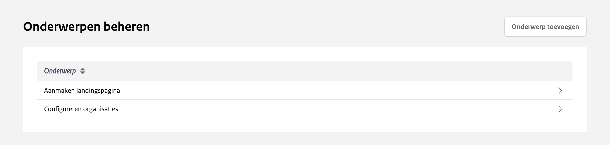
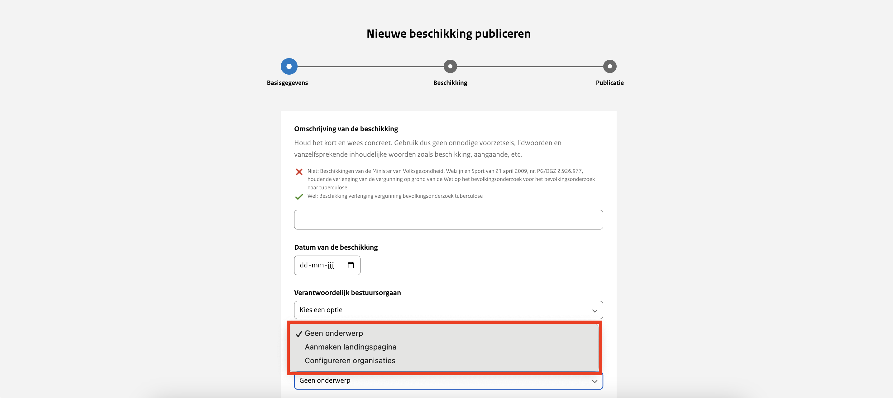

# Onderwerp koppelen aan publicatie

Het is mogelijk om een onderwerp te koppelen aan een publicatie. Hiermee kan je de openbaar gemaakte informatie voor de
organisatie logisch structureren, naast de bestaande structuur van informatiecategorieën. De onderwerpen zijn zichtbaar
op de landingspagina van de organisatie en kunnen gebruikt worden als filteroptie. Onderwerpen kunnen door de organisatie
zelf aangemaakt en beheerd worden. De gebruiker met de rechten ‘organisatie-beheer’ heeft toegang tot het menu ‘Onderwerpen’
in het uploadportaal.

Bij het aanmaken van een nieuwe publicatie kan gekozen worden uit de onderwerpen van de organisatie.

Het is niet nodig om de gewenste onderwerpen aan ons door te geven. Het kan wel handig zijn om hier alvast over na te denken.
