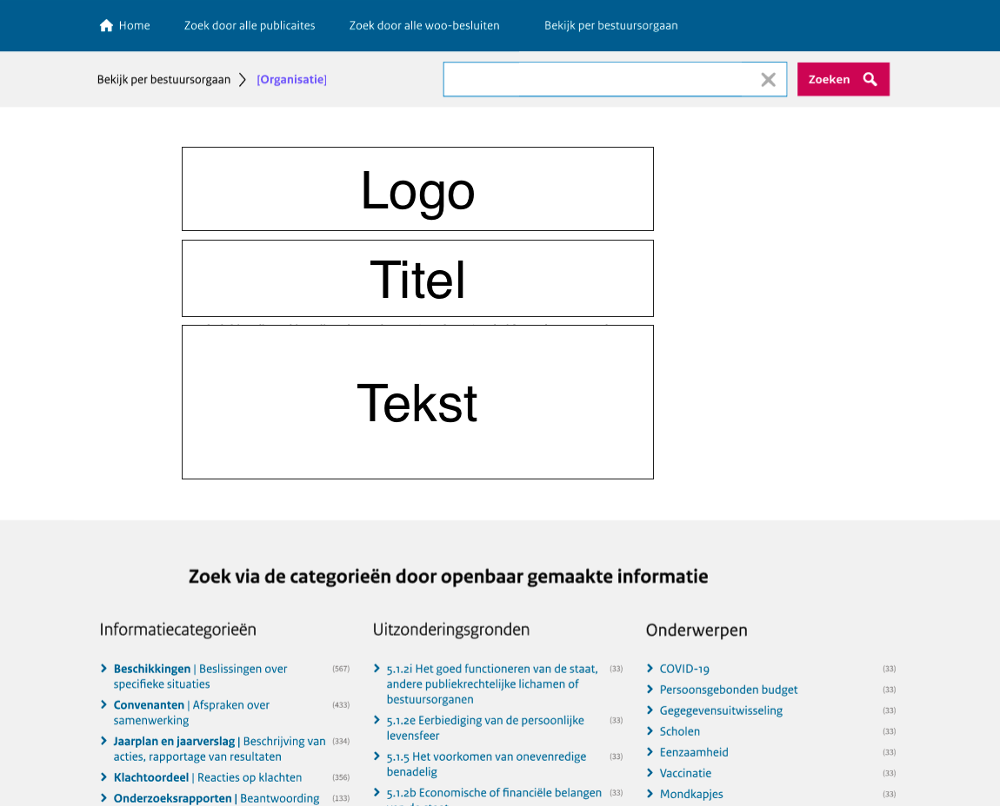
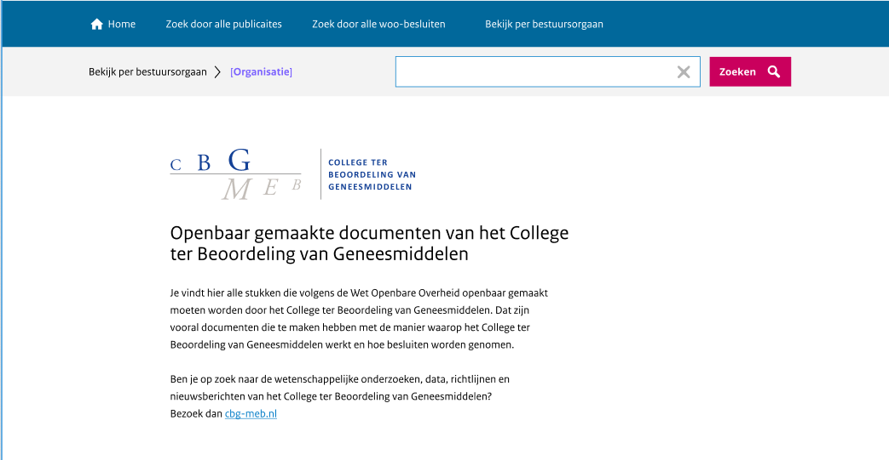

# Personaliseren van de landingspagina

Iedere concernorganisatie krijgt een eigen landingspagina op het publicatieplatform. Deze pagina is te personaliseren per organisatie
en op de pagina is de informatie te vinden die de organisatie gepubliceerd heeft.

Zie onderstaande afbeeldingen waarop de
indeling van de pagina te zien is en een voorbeeld van de concernorganisatie CBG.

**Voorbeeld:**

Om de landingspagina naar wens te kunnen ontwikkelen vragen we je om informatie aan te leveren. Om welke informatie het
gaat lees je in onderstaande paragrafen. We willen je vragen om de tabel uit Bijlage 1 in te vullen en per e-mail met ons
te delen via <woo-platform@irealisatie.nl>.

## Titel

Standaard is de titel: 'Openbaar gemaakte informatie van [naam organisatie]’. Ons advies is om in de titel van de landingspagina
minimaal de naam van de organisatie op te nemen.

## Introductietekst

Standaard is de introductietekst: 'Op deze pagina vindt u een overzicht van de informatie die door [naam organisatie] openbaar
gemaakt is op grond van de Wet open overheid.' Ons advies is om een korte uitleg te geven over wat de organisatie doet en welke
informatie de lezer op de pagina kan vinden. Daarnaast op welke websites en/of platformen de organisatie nog meer informatie
publiceert, welke informatie dat betreft en een link daar naartoe.

## Links

Standaard bevat de introductietekst geen links. Het is wel mogelijk om links op te nemen in de introductietekst.

## Logo

Standaard bevat de landingspagina geen logo. Het is wel mogelijk om het logo van de organisatie op de landingspagina te plaatsen.
Hiervoor willen we het logo ontvangen in het formaat: '.svg.'

## URL

Standaard is de URL van de landingspagina /[afkorting organisatie], bijvoorbeeld **/minvws**.
Het is mogelijk om hiervan af te wijken.
