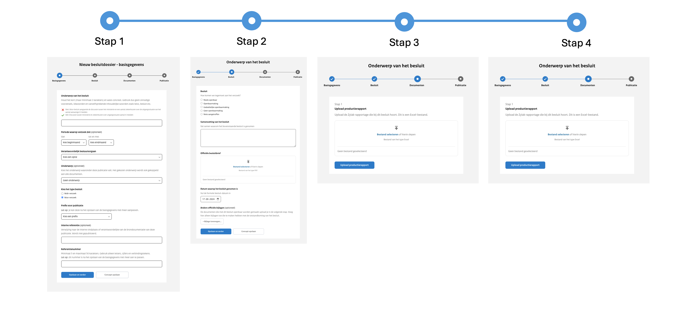

# Inleiding

In deze handleiding vind je alle informatie die je nodig hebt om een Woo-besluit succesvol te publiceren. Het is belangrijk
dat je al een account hebt met de rechten ‘publicatie-beheer’ in het uploadportaal, zodat je een publicatie kunt doen op
het publicatieplatform. Als je inlogt in het uploadportaal kom je terecht in het overzicht 'Alle publicaties'. Om een nieuwe publicatie
aan te maken, klik je rechtsboven op de knop ‘Nieuwe publicatie’ en selecteer je ‘Woo-besluit’. Het proces voor het aanmaken
van een nieuw Woo-besluit bestaat uit vier stappen:

1. Eerst voer je de basisgegevens in;
2. Dan voeg je de informatie over het besluit toe, waaronder de besluitbrief en eventuele bijlagen;
3. Vervolgens upload je het productierapport en de bijbehorende documenten;
4. Ten slotte stel je de publicatiedatum en eventueel de datum van feitelijke verstrekking in.

Een publicatie, zoals een Woo-besluit, kan vier statussen hebben: Concept, Publicatie gepland, Online voor verzoekers en Openbaar.
Afhankelijk van de status kun je de publicatie nog verwijderen of aanpassen.

## Woo-besluiten

De uploadstraat voor Woo-besluiten is anders dan de uploadstraten van de andere informatiecategorieën.
Deze uploadstraat bestaat uit vier stappen: basisgegevens, gegevens over het Woo-besluit, de openbaar te maken documenten en de
publicatiedatum. Het grootste verschil tussen de uploadstraten is dat documenten die openbaar worden gemaakt onder een Woo-besluit
in bulk geüpload worden en de bijbehorende metadata wordt vastgelegd in een productierapport.

### Basisgegevens

De basisgegevens (metadata) van de publicatie vul je in stap 1 van de uploadstraat in.

| Naam                                                     | Vereist | Toelichting                                                                                                                                                                |
| -------------------------------------------------------- | ------- | -------------------------------------------------------------------------------------------------------------------------------------------------------------------------- |
| Onderwerp van het Woo-Besluit                            | Ja      | Vrij invulveld, minimaal 2 karakters. Houd het kort en wees concreet. Wordt getoond als titel op de website.                                                               |
| Periode waarop het verzoek betrekking heeft (beginmaand) | Nee     | Keuze uit de huidige maand -10 jaar                                                                                                                                        |
| Periode waarop het verzoek betrekking heeft (eindmaand)  | Nee     | Keuze uit de huidige maand -10 jaar                                                                                                                                        |
| Verantwoordelijk bestuursorgaan                          | Ja      | Het bestuursorgaan dat verantwoordelijk is voor het Woo-besluit. Keuze uit een dropdownmenu.                                                                               |
| Type besluit                                             | Ja      | Keuze uit: Wob-verzoek en Woo-verzoek                                                                                                                                      |
| Onderwerp                                                | Nee     | Het onderwerp waar het Woo-besluit aan gekoppeld wordt. Keuze uit een dropdownmenu.                                                                                        |
| Prefix                                                   | Ja      | Keuze uit een dropdownmenu. Maakt samen met het referentienummer het ID van de publicatie uniek in.                                                                        |
| Interne referentie                                       | Nee     | Vrij invulveld. Bijvoorbeeld een verwijzing naar de interne vindplaats of verantwoordelijke van de brondocumentatie van deze publicatie. Wordt niet getoond op de website. |
| Referentienummer                                         | Ja      | Vrij invulveld, 3-50 karakters. Gebruik letters, cijfers en/of verbindingstekens. Uniek binnen de organisatie. Maakt samen met de prefix het ID van de publicatie uniek.   |

Gegevens over het Woo-besluit
De gegevens over het Woo-besluit (metadata) vul je in stap 2 van de uploadstraat in.

| Naam                                | Vereist | Toelichting                                                                                                                                                                                                       |
| ----------------------------------- | ------- | ----------------------------------------------------------------------------------------------------------------------------------------------------------------------------------------------------------------- |
| Woo-besluit                         | Ja      | Hoe tegemoet is gekomen aan het Woo-verzoek. Heeft betrekking op het gehele verzoek. Keuze uit de opties: Reeds openbaar, Openbaarmaking, Gedeeltelijke openbaarmaking, Geen openbaarmaking en Niets aangetroffen |
| Samenvatting van het besluit        | Ja      | Vrij invulveld, minimaal 1 karakter. Een korte samenvatting van de inhoud van het Woo-besluit. Wordt getoond onder de titel op de website.                                                                        |
| Officiële besluitbrief              | Ja      | Brief aan de verzoeker waarin wordt beschreven of en op welke manier aan zijn verzoek wordt voldaan. Het te uploaden bestand is van type `.pdf`.                                                                  |
| Datum waarop het besluit is genomen | Ja      | -                                                                                                                                                                                                                 |
| Andere officiële bijlagen           | Nee     | Mogelijkheid om een of meerdere bijlagen te uploaden die te maken hebben met de totstandkoming van het genomen besluit. De documenten die met dit besluit openbaar worden gemaakt upload je in de volgende stap.  |

### Openbaar te maken documenten

Documenten die openbaar worden gemaakt onder een Woo-besluit worden in bulk geüpload. De bijbehorende metadata wordt vastgelegd
in een productierapport. Het productierapport is een Excel-bestand met een aantal (verplichte) kolommen. Om het niet onnodig
ingewikkeld te maken op dit moment zijn een aantal niet verplichte kolommen buiten beschouwing gelaten.

:::{admonition} Let op!
:class: warning
Werken met een dergelijk productierapport sluit aan bij de werkwijze van de Programmadirectie Openbaarheid (PDO)
met betrekking tot het openbaar maken van COVID-19 gerelateerde Woo-besluiten. Indien er concernorganisaties zijn die Woo-besluiten
willen gaan publiceren op het publicatieplatform dan bespreken we graag of deze werkwijze werkbaar is of dat we een nieuwe uploadstraat
moeten toevoegen in dezelfde structuur als de uploadstraten van de andere informatiecategorieën.
:::

Het productierapport bestaat **ten minste** uit de volgende kolommen:

| kolomnaam         | Vereist | Toelichting                                                                                                                                                                                                           |
| ----------------- | ------- | --------------------------------------------------------------------------------------------------------------------------------------------------------------------------------------------------------------------- |
| ID                | Ja      | Een nummer dat het document identificeert. Het ID moet uniek zijn binnen een matter.                                                                                                                                  |
| Matter            | Ja      | Een nummer dat een verzameling van documenten identificeert. Binnen de matter moet een ID uniek zijn. Een matter bestaat uit minimaal 2 karakters.                                                                    |
| Document          | Ja      | De bestandsnaam van het document                                                                                                                                                                                      |
| Datum             | Ja      | De datum van het document. Voor e-mails is dit de datum waarop de email is verzonden. Voor andere bestandstype is dit de ‘laatst gewijzigd’-datum.                                                                    |
| Beoordeling       | Ja      | Beoordeling van het document. Keuze uit: *reeds openbaar, openbaar, deelsopenbaar* en *niet openbaar*                                                                                                                 |
| Beoordelingsgrond | Nee     | De beoordelingsgrond (ook wel: weigeringsgrond) die is gebruikt in het document om gegevens te lakken. Beoordelingsgronden kunnen zowel wetsartikelen uit de woo (nieuwe besluiten) als de wob (oude besluiten) zijn. |
| Publieke Link     | Nee     | Indien de beoordeling van het document ‘Reeds openbaar is’ kan in deze kolom de URL worden opgenomen waar het document te vinden.                                                                                     |

Na het uploaden van het productierapport kunnen de documenten geüpload worden. De bestandsnaam dient gelijk te zijn aan het
ID uit het productierapport en enkel het bestandstype .pdf kan op dit moment geüpload worden. Ons advies is om grotere aantallen
documenten te bundelen in een .zip of .7z bestand en deze te uploaden voor een snellere verwerking van de documenten.

De bestandstype die worden ondersteund zijn: Afbeelding, Chatbericht, E-mailbericht, Notitie, PDF,
Presentatie, Spreadsheet, Video, Audio, Visitekaartje, Webpagina, Word-document, XML, Zip-bestand en .TXT.

Wanneer het veld leeg is, is het type Onbekend.
