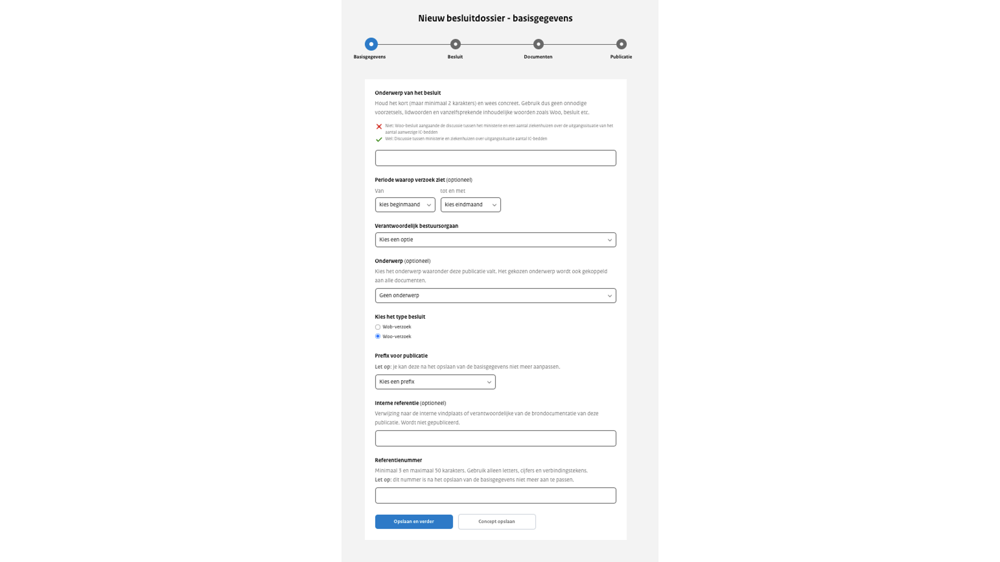

# Uploadstraat stap 1: Basisgegevens

Voordat je een document kunt uploaden moet je eerst enkele basisgegevens invullen. Deze gegevens helpen om het besluit gemakkelijker
terug te vinden. Zolang het besluit nog niet is gepubliceerd kunnen de basisgegevens nog gedeeltelijk worden aangepast.
Ook na publicatie kunnen de basisgegevens nog worden bijgewerkt. Het referentienummer en de prefix kunnen achteraf niet meer aangepast worden.

Onderwerp van het besluit
: Het onderwerp van het besluit wordt als titel getoond op de website. In de omschrijving van het onderwerp gebruik je geen onnodige
voorzetsels, lidwoorden of vanzelfsprekende inhoudelijke woorden zoals ‘Woo-besluit’  Dit veld is verplicht om in te vullen.

Periode waarop het verzoek betrekking heeft
: Voor de periode waarop het verzoek betrekking heeft, kun je kiezen binnen een bereik van de huidige maand ± 10 jaar. Als er geen
periode is opgegeven, wordt standaard "alles" geselecteerd. Wanneer alleen een begindatum of einddatum wordt ingevoerd, wordt
de status respectievelijk weergegeven als "vanaf ..." of "tot ...".

Verantwoordelijk bestuursorgaan
: Kies uit het dropdown-menu het bestuursorgaan dat verantwoordelijk is voor deze publicatie. Is er slechts één keuze, dan is deze
optie voor je geselecteerd. Het is alleen mogelijk om namens een bestuursorgaan te publiceren dat aan je organisatie is gekoppeld.
Een bestuursorgaan kan aan meerdere organisaties gekoppeld worden. Dit veld is verplicht om in te vullen.

Onderwerp
: Hier selecteer je een onderwerp uit een lijst van onderwerpen die van toepassing zijn op deze publicatie. De onderwerpen worden
aangemaakt door de organisatiebeheerder van je organisatie. Dit veld is optioneel.

Type besluit
: Keuze uit: Wob-besluit en Woo-besluit. Standaard is het type Woo-besluit geselecteerd.

Prefix voor documenten
: Kies uit het dropdown-menu een prefix. Is er slechts één keuze, dan is deze optie voor je geselecteerd. De combinatie van prefix
en referentienummer moet uniek zijn binnen de organisatie. Dit veld is verplicht om in te vullen.

:::{admonition} Let op!
:class: attention
Het is niet mogelijk om de prefix te wijzigen, nadat je deze hebt opgeslagen.
:::

Interne referentie
: Dit is een vrij invulveld. Dit kan gebruikt worden voor bijvoorbeeld een verwijzing naar de interne vindplaats of verantwoordelijke
van de brondocumentatie van deze publicatie. Dit veld wordt niet getoond op de website. Dit veld is optioneel.

Referentienummer
: Vul een referentienummer in voor deze publicatie. Het referentienummer mag bestaan uit letters, cijfers en verbindingstekens.
De combinatie van het referentienummer en de prefix moet uniek zijn binnen de organisatie. Dit veld is verplicht om in te vullen.

:::{admonition} Let op!
:class: attention
Na het opslaan van deze stap kun je het referentienummer niet meer aanpassen, dus voer het zorgvuldig in.
:::

Om verder te gaan klik je op ‘opslaan en verder’. Als je terug naar het hoofdmenu wil, klik je op ‘Concept opslaan’.
