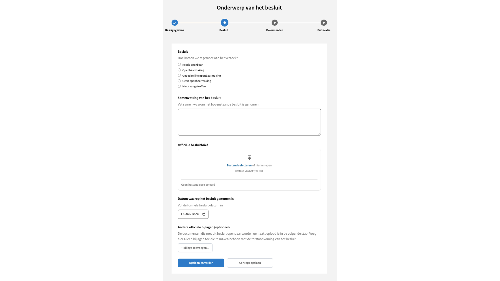
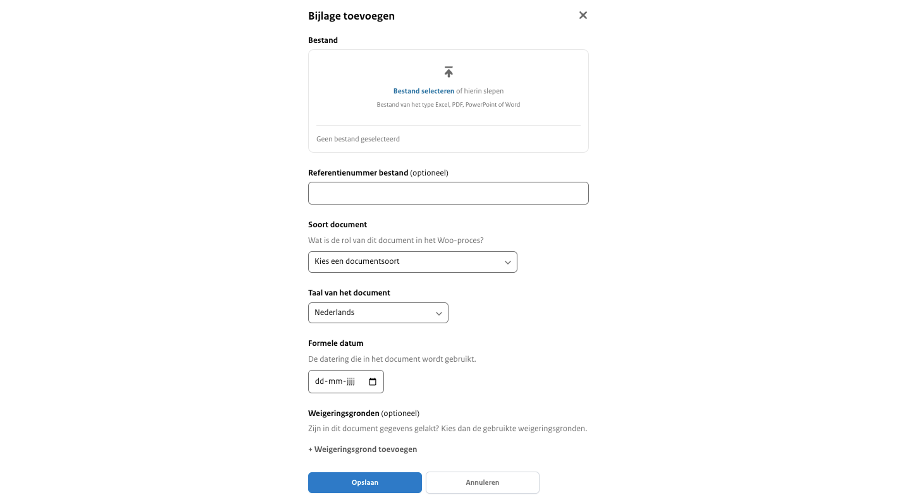

# Stap  2: Woo-besluit gegevens

Bij stap 2 worden de gegevens van het Woo-besluit ingevuld en wordt de besluitbrief geüpload. Daarnaast is het mogelijk om een bijlage toe te voegen.

## Besluit Oordeel

Hoe tegemoet is gekomen aan het Woo-verzoek. Deze status heeft betrekking op het gehele verzoek. Dit veld is verplicht om in te vullen. Keuze uit de opties:
Reeds openbaar, Openbaarmaking, Gedeeltelijke openbaarmaking, Geen openbaarmaking en Niets aangetroffen.

In de gevallen van geen openbaarmaking of niets aangetroffen zal stap 3 van de uploadstraat worden overgeslagen.

## Samenvatting van het besluit

Hier geef je een korte samenvatting over waarom het besluit is genomen.
Deze samenvatting verschijnt bovenaan de publicatie op de website en biedt een overzichtelijke introductie van de belangrijkste punten.
Zorg ervoor dat de samenvatting helder en informatief is, zodat lezers snel begrijpen waar het besluit over gaat. Dit veld is verplicht om in te vullen.

## Officiële besluitbrief

Hier upload je de officiële besluitbrief aan de verzoeker waarin wordt beschreven of en op welke manier aan het verzoek wordt
voldaan. Het bestand moet worden geüpload in het formaat .pdf. Dit veld is verplicht om in te vullen. Let erop dat de juiste gegevens
gelakt zijn, bijvoorbeeld de NAW-gegevens van de verzoeker.

## Datum waarop het besluit is genomen

Dit is de officiële datum waarop het besluit is genomen. Dit veld is verplicht om in te vullen.

## Bijlage

In het geval dat er extra ondersteunende documenten zijn, is er de mogelijkheid om een of meerdere bijlagen te uploaden die
horen bij het Woo-besluit. Het uploaden van een bijlage is optioneel.

### Bestand

Hier upload je maximaal één bestand van het type PDF, Excel, Word of PowerPoint.

### Referentienummer bestand

Dit is een vrij invulveld. Bijvoorbeeld een verwijzing naar de interne vindplaats of verantwoordelijke van het document. Wordt niet getoond op de website.

### Soort document

Je geeft hier aan wat voor soort document dat de bijlage is. Dit is een standaard lijst met documentsoorten waar je uit kan kiezen.

### Taal van het document

Keuze uit Nederlands (standaard ingevuld) of Engels.

### Formele datum

De datum die wordt gehanteerd in het document.

### Weigeringsgronden

De weigeringsgrond(en) die is/zijn gebruikt in het document om gegevens te lakken afkomstig uit de Wet open overheid.
Dit is een standaardlijst met weigeringsgronden waar je uit kan kiezen.
