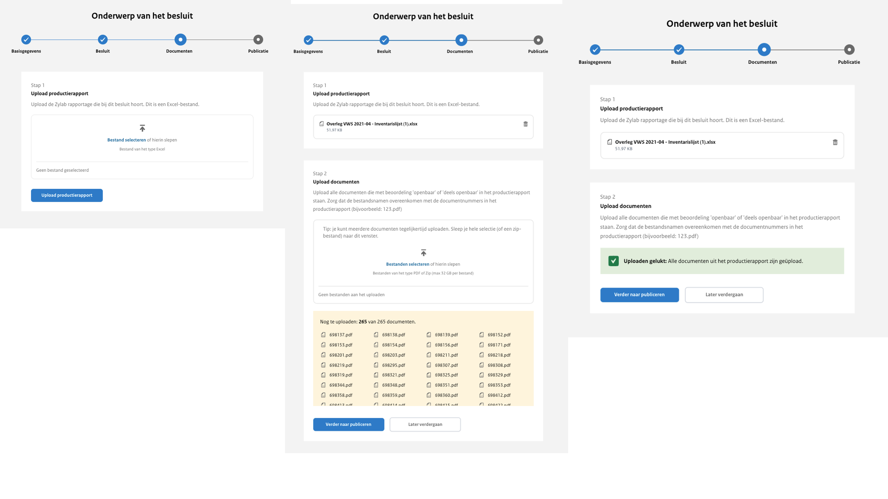

# Stap  3: Productierapport uploaden

In stap 3 upload je eerst het productierapport. Het productierapport is een Excel-document met daarin de metadata van de te uploaden
Woo-documenten. Meer informatie over de inhoud van het productierapport lees je in hoofdstuk 5. Tijdens het uploaden wordt het
productierapport gecontroleerd door het systeem. Het kan voorkomen dat naar aanleiding hiervan een foutmelding verschijnt. Het kan
bijvoorbeeld zijn dat er een verplichte kolom mist in het productierapport of dat de combinatie van matter en ID al voorkomt bij een andere publicatie.

Nadat het productierapport succesvol is geüpload, verschijnt de zogenaamde dropzone voor het uploaden van de Woo-documenten met
de beoordeling ‘openbaar’ en ‘deels openbaar’. Het is mogelijk om de betreffende documenten te selecteren en te uploaden of om
een .zip of .7z bestand te uploaden waarin alle documenten gebundeld zijn, de maximale grootte per bestand is 5 GB.
Nadat je dit hebt gedaan gaat het systeem op de achtergrond aan de slag.

Eerst wordt gecontroleerd of de bestandsnaam van een document matcht met een ID in het productierapport, wordt het document
gescand op virussen en opgeslagen. Indien de bestandsnaam van een document niet matcht met een ID in het productierapport dan
wordt dit document niet opgeslagen. Op deze manier kunnen er nooit te veel documenten worden geüpload of per ongeluk een onjuist
document. Een document wordt ook niet opgeslagen indien het bestandsformaat ongeldig is of er mogelijk een virus is gevonden,
hiervan wordt een melding getoond.

Vervolgens worden de documenten één voor één verwerkt. Tijdens de verwerking wordt het documenten onder andere zo toegankelijk
mogelijk gemaakt en wordt de inhoud geëxtraheerd zodat dit toegevoegd kan worden aan de zoekmachine. Het verwerken van alle documenten
kan tijdsintensief zijn. Je kan het scherm verlaten en later terugkeren als het systeem klaar is met het verwerken van de documenten.

Het is mogelijk om eventueel resterende documenten op een later moment te uploaden. Wanneer alle op basis van het productierapport
verwachte documenten zijn geüpload kan je verder naar stap 4.

Woo-documenten met de beoordeling ‘niet openbaar’ en ‘reeds openbaar’, aangegeven in het productierapport, behoeven geen upload.
Voor deze documenten wordt wel een pagina aangemaakt op de website, zonder dat daarbij een bestand beschikbaar is.
