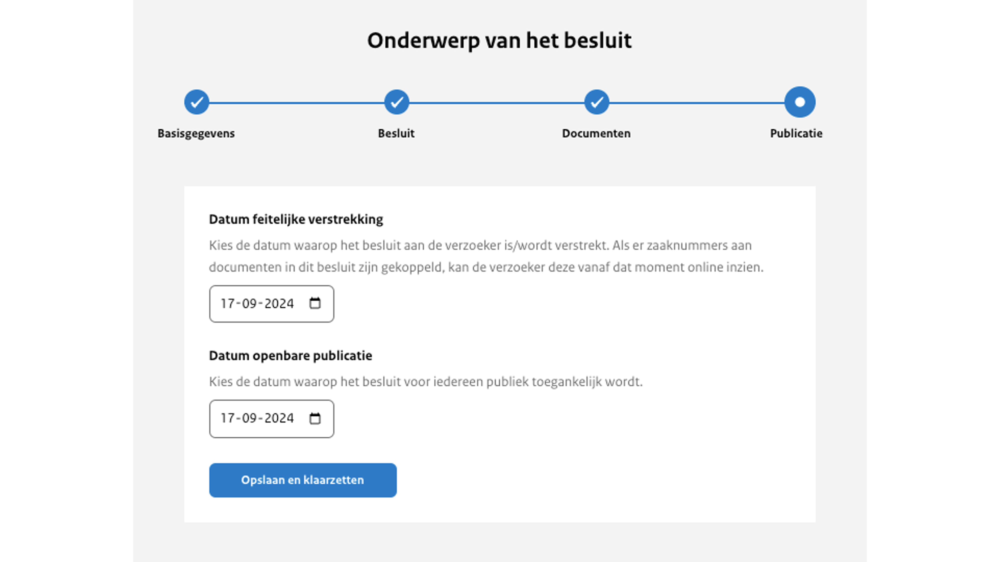

# Uploadstraat stap 4: publiceren en klaarzetten

Voor publicatie verwacht de uploadomgeving twee datums:

Datum feitelijke verstrekking
: Op deze datum zijn de Woo-documenten uit het Woo-besluit die zijn gekoppeld aan een zaaknummer
zichtbaar op de betreffende zaakpagina. Het is niet noodzakelijk om te werken met de feitelijke verstrekking. Wil je dit niet dan
vul je dezelfde datum in als bij de openbare publicatie. Meer informatie over de  zaakpagina’s lees je in hoofdstuk 6.

Datum openbare publicatie
: Op deze datum komt het besluit openbaar op het publicatieplatform. Deze individuele linkjes van de feitelijke verstrekking zullen blijven werken.
